# 多线程

## 一丶概念

### 1.什么是进程？

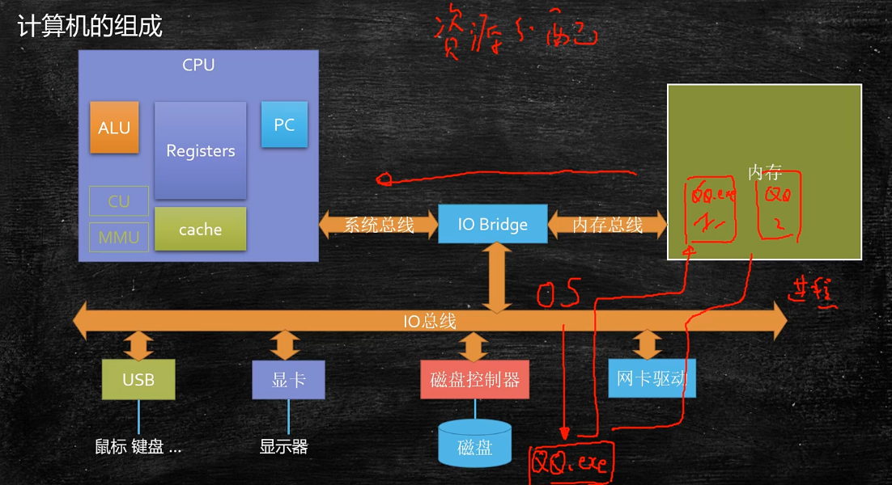

进程是计算机进行资源分配的最小单位

### 2.什么是线程？

单线程：

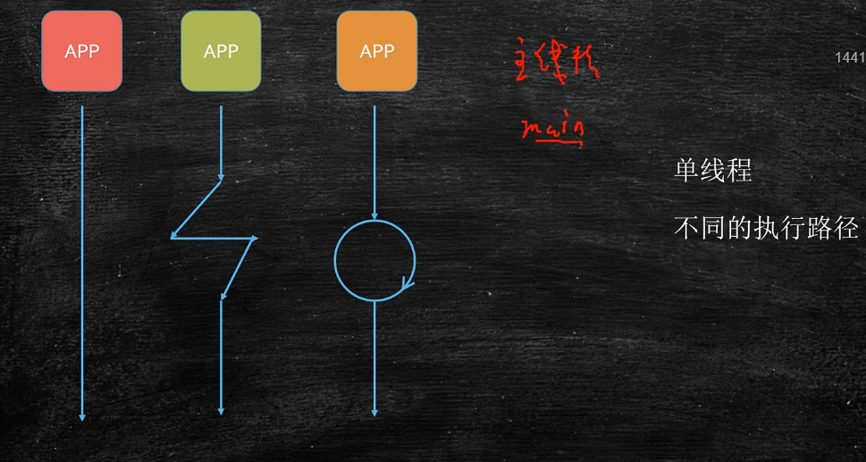

多线程:

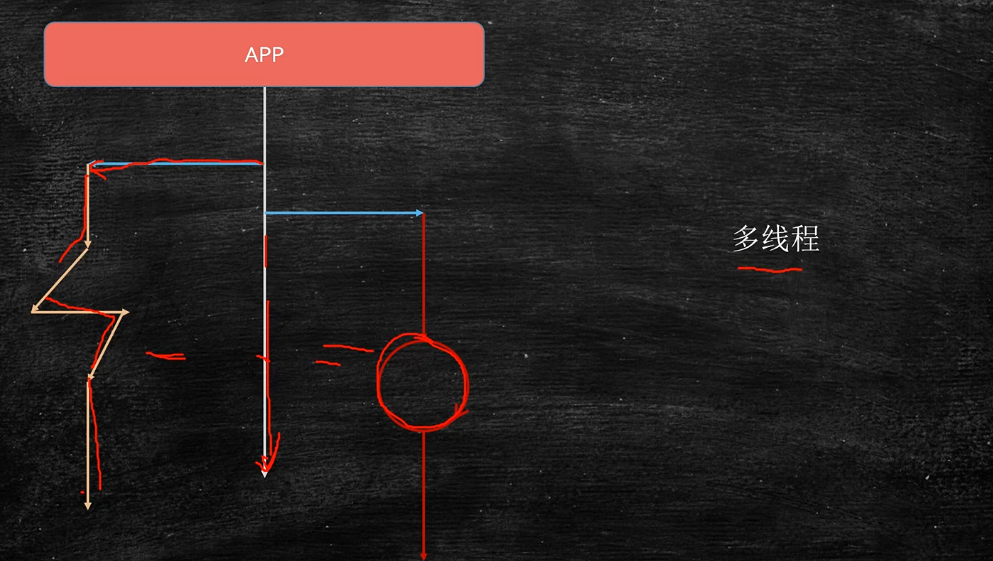

线程是调度执行的最小单位，多个线程共享同一进程的所有资源。

### 3.线程切换

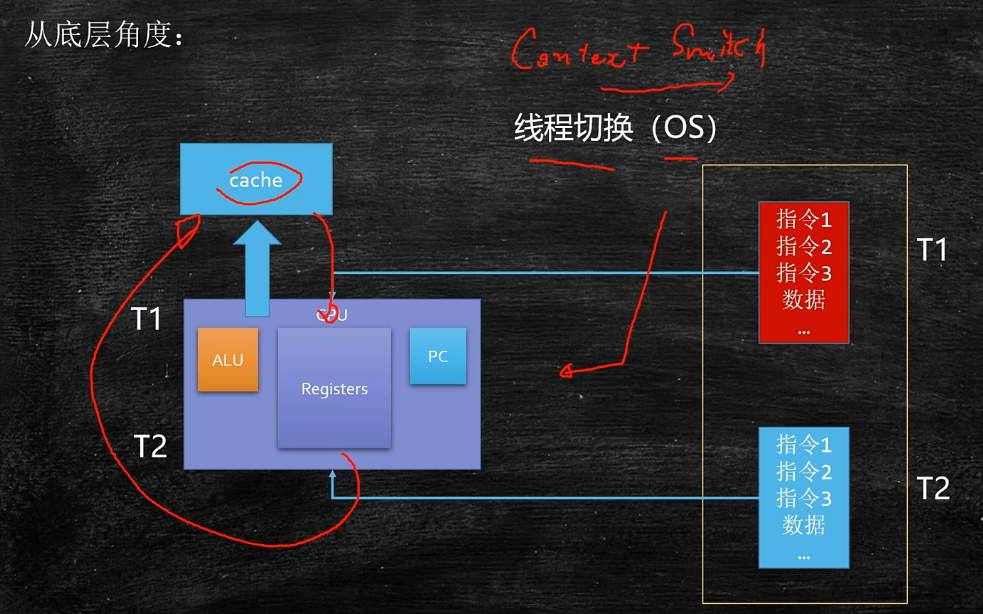

线程的切换也是需要消耗资源的，所以工作线程数不是越大越好。

### 4.线程设置多少合适

计算公式：

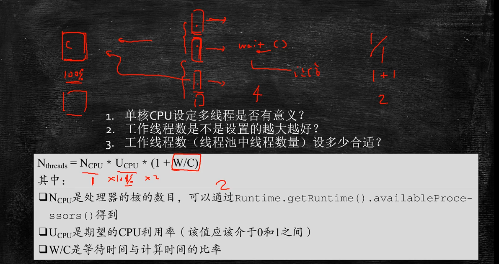

W/C确定方法:使用profiler工具进行监测

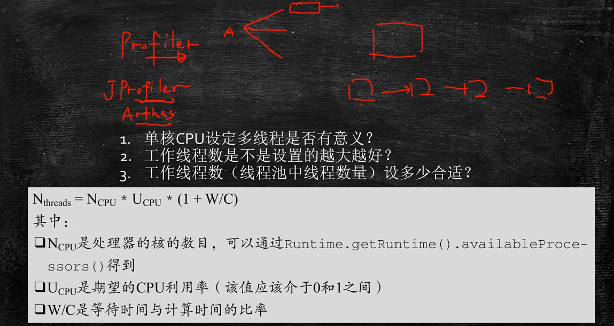

## 二丶创建线程的方式

### 1.继承Thread类

### 2.实现Runable接口

### 3.Lambda表达式

### 4.线程池

### 5.实现Callable接口

本质上只有一种方式，就是 new Thread() 

```java
package com.mantou.create;

import java.util.concurrent.*;

/**
 * @author mantou
 * @date 2021/11/9 15:21
 * @desc 创建线程的五种方式
 */
class MyThread extends Thread {
    public void run(){
        System.out.println("hello MyThread!");
    }
}
class MyRunable implements Runnable{

    @Override
    public void run() {
        System.out.println("hello MyRunable");
    }
}

class MyCall implements Callable<String>{

    @Override
    public String call() throws Exception {
        System.out.println("hello MyCall");
        return "success";
    }
}
public class CreateTest {
    public static void main(String[] args) throws ExecutionException, InterruptedException {
        //1.自定义类继承Thread类
        new MyThread().start();
        //2.自定义类实现Runable接口
        new Thread(new MyRunable()).start();
        //3.Lambda表达式
        new Thread(() -> {
            System.out.println("hello Thread");
        }).start();
        //4.使用线程池
        ExecutorService service = Executors.newCachedThreadPool();
        service.execute(()->{
            System.out.println("hello service");
        });

        //5.Callable接口，接收带返回值的线程方法
        Future<String> future = service.submit(new MyCall());
        String data = future.get();
        System.out.println(data);
        service.shutdown();
         //6.不使用线程池运行Callable
        FutureTask<String> task = new FutureTask<>(new MyCall());
        new Thread(task).start();
        System.out.println(task.get());
    }
}
```

## 三丶线程的状态

### 1.线程的状态


### 2.线程状态迁移

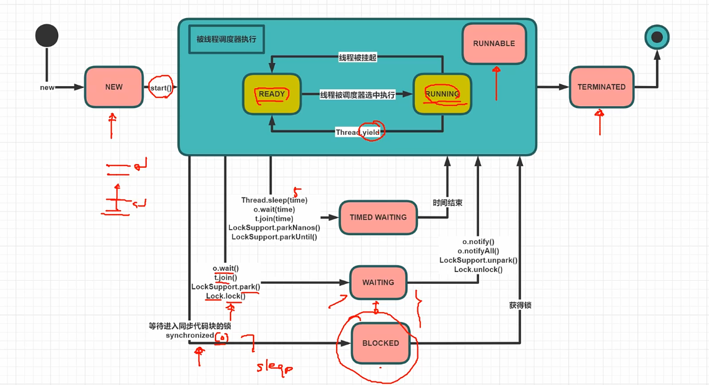

### 3.线程状态案例

```java
package com.mantou.create;

import com.mantou.utils.SleepHelper;

import java.util.concurrent.locks.Lock;
import java.util.concurrent.locks.LockSupport;
import java.util.concurrent.locks.ReentrantLock;

/**
 * @author mantou
 * @date 2021/11/9 16:42
 * @desc  线程状态
 */
public class ThreadStateTest {
    public static void main(String[] args) throws Exception {
        System.out.println("-----------------------------------------");
        Thread t1 = new Thread(() -> {
            System.out.println("2:" + Thread.currentThread().getState());
            for (int i = 0; i < 3; i++) {
                SleepHelper.sleepSeconds(1);
                System.out.print(i + " ");
            }
            System.out.println();
        });
        System.out.println("1:" + t1.getState());
        t1.start();
        t1.join();
        System.out.println("3:" + t1.getState());
        System.out.println("-----------------------------------------");

        Thread t2 = new Thread(() -> {
            LockSupport.park();
            System.out.println("t2 go on!");
            SleepHelper.sleepSeconds(5);
        });
        t2.start();;
        SleepHelper.sleepSeconds(1);
        System.out.println("4:" + t2.getState());

        LockSupport.unpark(t2);
        SleepHelper.sleepSeconds(1);
        System.out.println("5:"+ t2.getState());
        System.out.println("-----------------------------------------");
        final Object o = new Object();
        Thread t3 = new Thread(() -> {
            synchronized (o) {
                System.out.println("t3 得到了锁 o");
            }
        });
        new Thread(() -> {
            synchronized (o) {
                SleepHelper.sleepSeconds(5);
            }
        }).start();

        SleepHelper.sleepSeconds(1);
        t3.start();
        SleepHelper.sleepSeconds(1);
        System.out.println("6:" + t3.getState());
        System.out.println("-----------------------------------------");
        final Lock lock = new ReentrantLock() ;
        Thread t4 = new Thread(() -> {
            lock.lock();
                System.out.println("t4 得到了锁 o");
            lock.unlock();
        });
        new Thread(() -> {
            lock.lock();
                SleepHelper.sleepSeconds(5);
            lock.unlock();
        }).start();

        SleepHelper.sleepSeconds(1);
        t4.start();
        SleepHelper.sleepSeconds(1);
        System.out.println("7:" + t4.getState());
        System.out.println("-----------------------------------------");
        Thread t5 = new Thread(() -> {
            LockSupport.park();
        });
        t5.start();
        SleepHelper.sleepSeconds(1);
        System.out.println("8:" + t5.getState());
        LockSupport.unpark(t5);
    }
}
```

## 四丶线程打断

### 1.线程打断3方法

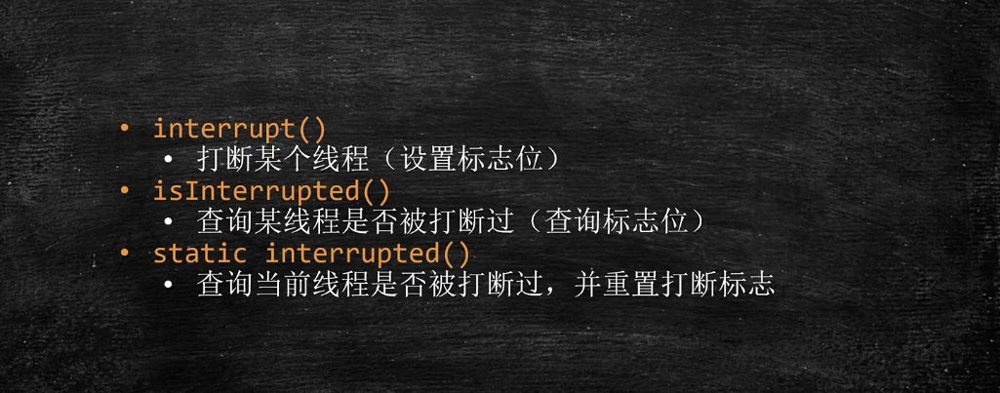

### 2.设置打断标志位和查询打断标志位

```java
package com.mantou.interrupt;

import com.mantou.utils.SleepHelper;

/**
 * @author mantou
 * @date 2021/11/9 17:21
 * @desc 设置打断标志位和查询打断标志位
 */
public class InterruptTest {
    public static void main(String[] args) {
        Thread t1 = new Thread(() -> {
            for (; ; ) {
                if (Thread.currentThread().isInterrupted()) {
                    System.out.println("设置了打断标志位");
                    System.out.println(Thread.currentThread().isInterrupted());  //true
                    break;
                }
            }
        });
        t1.start();
        SleepHelper.sleepSeconds(1);
        t1.interrupt();
    }
}
```

### 3.interrupted

判断是否设置打断标志位，并重置打断标志位

```java
package com.mantou.interrupt;

import com.mantou.utils.SleepHelper;
/**
 * @author mantou
 * @date 2021/11/9 17:29
 * @desc Interrupted
 */
public class InterruptedTest {
    public static void main(String[] args) {
        Thread t1 = new Thread(() -> {
            for (; ; ) {
                if (Thread.interrupted()) {
                    System.out.println("设置了打断标志位");
                    System.out.println(Thread.interrupted());   //false
                    break;
                }
            }
        });
        t1.start();
        SleepHelper.sleepSeconds(2);
        t1.interrupt();
    }
}
```

### 4.sleep

```java
package com.mantou.interrupt;

import com.mantou.utils.SleepHelper;

/**
 * @author mantou
 * @date 2021/11/9 17:36
 * @desc InterruptSleep
 */
public class InterruptSleepTest {
    public static void main(String[] args) {
        Thread t = new Thread(() -> {
            try {
                Thread.sleep(10000);
            } catch (InterruptedException e) {
                System.out.println("设置了打断标志位");
                System.out.println(Thread.currentThread().isInterrupted());  //false jdk抓住异常会自动重置标志位
            }
        });
        t.start();
        SleepHelper.sleepSeconds(5);
        t.interrupt();
    }
}
```

### 5.wait

```java
package com.mantou.interrupt;

import com.mantou.utils.SleepHelper;
/**
 * @author mantou
 * @date 2021/11/9 17:41
 * @desc InterruptWait
 */
public class InterruptWaitTest {
    private static Object o = new Object() ;
    public static void main(String[] args) {
        Thread t = new Thread(() -> {
            synchronized (o) {
                try {
                    o.wait();
                } catch (InterruptedException e) {
                    System.out.println("设置了打断标志位");
                    System.out.println(Thread.currentThread().isInterrupted());  //false jdk抓住异常会自动重置标志位
                }
            }

        });
        t.start();
        SleepHelper.sleepSeconds(5);
        t.interrupt();
    }
}
```

### 6.sync     

设置标志位不会打断sync锁

```java
package com.mantou.interrupt;

import com.mantou.utils.SleepHelper;

/**
 * @author mantou
 * @date 2021/11/9 17:53
 * @desc InterruptSync
 */
public class InterruptSync {
    private static Object o = new Object() ;
    public static void main(String[] args) {
        Thread t1 = new Thread(() -> {
            synchronized (o) {
                SleepHelper.sleepSeconds(10);
            }
        });
        t1.start();
        SleepHelper.sleepSeconds(1);
        Thread t2 = new Thread(() -> {
            synchronized (o) {

            }
            System.out.println("t2 over");
        });
        t2.start();
        t2.interrupt();
    }
}
```

### 7.Lock

interrupt是干扰不到Lock锁的

```java
package com.mantou.interrupt;

import com.mantou.utils.SleepHelper;

import java.util.concurrent.locks.Lock;
import java.util.concurrent.locks.ReentrantLock;

/**
 * @author mantou
 * @date 2021/11/9 18:08
 * @desc InterruptLock
 */
public class InterruptLock {
    private static Lock lock = new ReentrantLock() ;
    public static void main(String[] args) {
        Thread t1 = new Thread(() -> {
            lock.lock();
                SleepHelper.sleepSeconds(10);
            lock.unlock();
        });
        t1.start();
        SleepHelper.sleepSeconds(1);
        Thread t2 = new Thread(() -> {
           lock.lock();

            lock.unlock();
            System.out.println("t2 over");
        });
        t2.start();
        t2.interrupt();
    }
}
```

### 8.LockInterruptibly

使用lock.lockInterruptibly() 方法加锁，可以被Interrupt干扰到

```java
package com.mantou.interrupt;

import com.mantou.utils.SleepHelper;

import java.util.concurrent.locks.Lock;
import java.util.concurrent.locks.ReentrantLock;

/**
 * @author mantou
 * @date 2021/11/9 18:13
 * @desc InterruptLockInterruptibly
 */
public class InterruptLockInterruptibly {
    private static Lock lock = new ReentrantLock() ;
    public static void main(String[] args) {
        Thread t1 = new Thread(() -> {
            lock.lock();
            SleepHelper.sleepSeconds(10);
            lock.unlock();
        });
        t1.start();
        SleepHelper.sleepSeconds(1);
        Thread t2 = new Thread(() -> {
            try {
                lock.lockInterruptibly();     //这个方法可以干扰到抢锁
            } catch (InterruptedException e) {
                e.printStackTrace();
            }
            lock.unlock();
            System.out.println("t2 over");
        });
        t2.start();
        t2.interrupt();
    }
}
```

## 五丶线程结束

### 1.stop方法

不建议使用，太过暴力，容易产生数据不一致问题

```java
package com.mantou.stop;

import com.mantou.utils.SleepHelper;

/**
 * @author mantou
 * @date 2021/11/9 18:19
 * @desc stop
 */
public class StopTest {
    public static void main(String[] args) {
        Thread t = new Thread(() -> {
            while (true) {
                SleepHelper.sleepSeconds(1);
                System.out.println("go on");
            }
        });
        t.start();
        SleepHelper.sleepSeconds(5);
        t.stop();
    }
}
```

### 2.suspend和resume

不建议使用，如果suspend时持有锁，容易产生死锁。

```java
package com.mantou.stop;

import com.mantou.utils.SleepHelper;
/**
 * @author mantou
 * @date 2021/11/9 18:26
 * @desc SuspendResume
 */
public class SuspendResume {
    public static void main(String[] args) {
        Thread t = new Thread(() -> {
            while (true) {
                SleepHelper.sleepSeconds(1);
                System.out.println("go on");
            }
        });
        t.start();
        SleepHelper.sleepSeconds(2);
        t.suspend();
        SleepHelper.sleepSeconds(5);
        t.resume();
    }
}
```

### 3.volatile

```java
package com.mantou.stop;

import com.mantou.utils.SleepHelper;

/**
 * @author mantou
 * @date 2021/11/9 18:32
 * @desc VolatileTest
 */
public class VolatileTest {
    private static volatile Boolean running = true ;
    public static void main(String[] args) {
        Thread t = new Thread(() -> {
            long i = 0l ;
            while (running){
                i++ ;   //使用 wait recv occept 会阻塞
            }
            System.out.println(i); //3407256287  3537106250   ，不能精确控制
        });

        t.start();
        SleepHelper.sleepSeconds(3);
        running = false ;

    }
}
```

### 4.interrupt

```java
package com.mantou.stop;

import com.mantou.utils.SleepHelper;

/**
 * @author mantou
 * @date 2021/11/9 18:39
 * @desc InterruptStop
 */
public class InterruptStop {
    public static void main(String[] args) {
        Thread t = new Thread(() -> {
            while (!Thread.interrupted()) {
                //sleep wait 也能正常结束
            }
            System.out.println(" t stop ");
        });
        t.start();
        SleepHelper.sleepSeconds(1);
        t.interrupt();
    }
}
```

## 六丶并发编程三大特性

### 1.三大特性


### 2.可见性

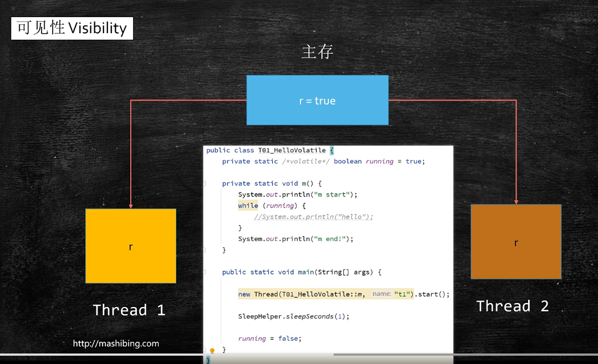

#### 1.volatile保持可见性

被volatile修饰得内存数据，会对所有线程保持可见，线程每次读取数据都去主内存读一遍

```java
package com.mantou.visibility;

import com.mantou.utils.SleepHelper;

/**
 * @author mantou
 * @date 2021/11/10 10:09
 * @desc volatile保持可见性
 */
public class volatileTest {
    private static volatile  Boolean running = true ;
    private static void get(){
        System.out.println( "start！");
        while (running) {
            //System.out.println(running);  会造成内存缓存同步刷新

        }
        System.out.println("end！");
    }
    public static void main(String[] args) {

        new Thread(volatileTest::get,"t1").start();

        SleepHelper.sleepSeconds(1);

        running = false;
    }
}
```

注意：某些语句可能触发内存缓存同步刷新，System.out.println(running); ，底层加了Sync锁

#### 2.volatile修饰引用数据类型

volatile修饰引用数据类型（包括数组），只能保证引用本身的可见性，不能保证内部字段的可见性。

```java
package com.mantou.visibility;

import com.mantou.utils.SleepHelper;
import jdk.nashorn.internal.ir.WhileNode;

/**
 * @author mantou
 * @date 2021/11/10 10:35
 * @desc volatile  修饰引用数据类型
 */
public class VolatileTest02 {

    private static class A {
        Boolean running = true ;
        void m(){
            System.out.println("start");
            while (running) {

            }
            System.out.println("end");
        }
    }

    private volatile static  A a = new A() ;
    public static void main(String[] args) {
        new Thread(a::m,"t1").start();
        SleepHelper.sleepSeconds(1);
        a.running = false ;
    }
}
```

#### 3.三级缓存

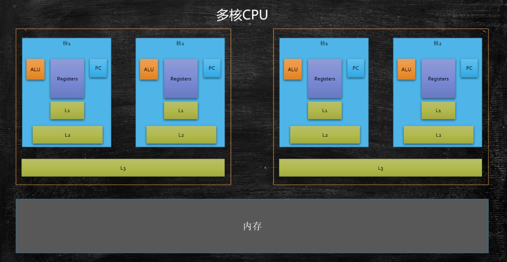

#### 4.缓存行

一个缓存行占64个字节

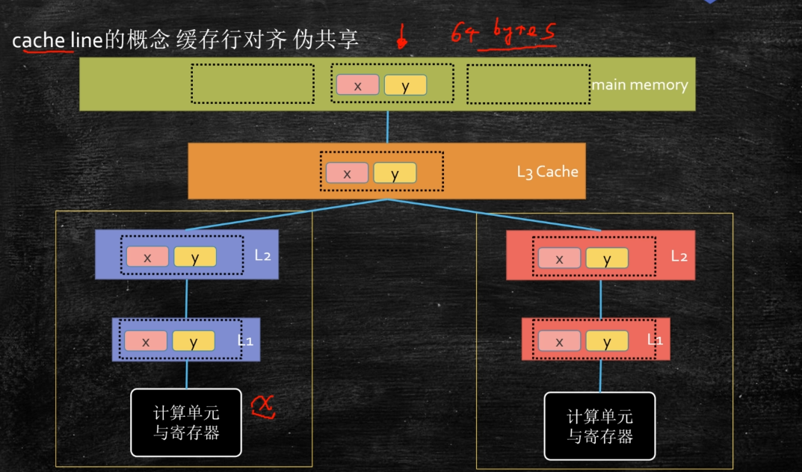

实验：

```java
package com.mantou.visibility;

import java.util.concurrent.CountDownLatch;

/**
 * @author mantou
 * @date 2021/11/10 13:38
 * @desc 缓存一致性
 */
public class CacheLineTest {
    public static long COUNT = 1000000000L;

     private static class T {
         private long p1,p2,p3,p4,p5,p6,p7 ;
         public long x = 0L ;       //  8 bytes
         private long p9,p10,p11,p12,p13,p14,p15 ;
     }

     public static T[] arr = new T[2] ;

     static  {
         arr[0] = new T() ;
         arr[1] = new T() ;
     }

    public static void main(String[] args) throws InterruptedException {
        CountDownLatch latch = new CountDownLatch(2) ;
        Thread t1 = new Thread(() -> {
            for (int i = 0; i < COUNT; i++) {
                arr[0].x = i;
            }
            latch.countDown();
        });

        Thread t2 = new Thread(() -> {
            for (int i = 0; i < COUNT; i++) {
                arr[1].x = i;
            }
            latch.countDown();
        });

        final long start = System.nanoTime() ;
        t1.start();
        t2.start();
        latch.await();
        final long end = System.nanoTime() ;
        System.out.println((end - start) / 1000000);


    }
}
```

### 3.有序性

#### 1.乱序

一个线程中，程序不是从上往下按顺序执行的。

#### 2.乱序原因

如果上下两条代码之间没有依赖关系，则有可能乱序，是为了提高效率。


#### 3.乱序条件

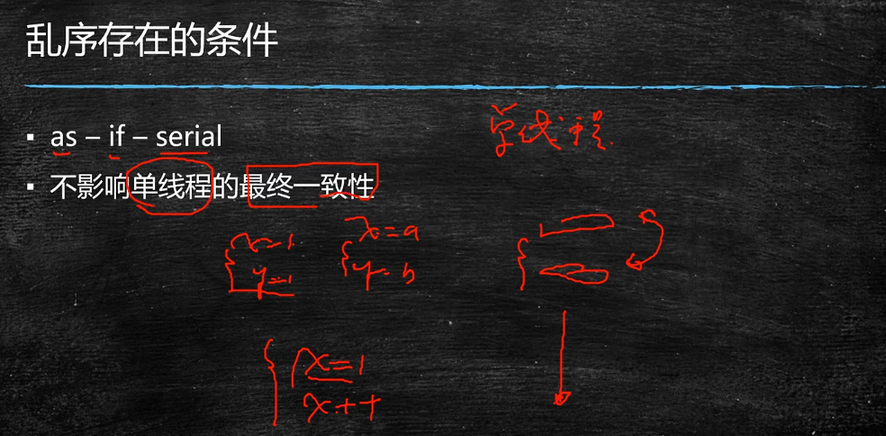

### 4.原子性

案例：

```java
package com.mantou.atomicity;

import java.util.concurrent.CountDownLatch;

/**
 * @author mantou
 * @date 2021/11/10 17:06
 * @desc 原子性测试
 */
public class Plus2Test {
    private static long n = 0L ;

    public static void main(String[] args) throws InterruptedException {
        Thread[] threads = new Thread[100] ;
        CountDownLatch latch = new CountDownLatch(threads.length);
        for (int i = 0; i < threads.length; i++) {
            threads[i] = new Thread(() -> {
                for (int j = 0; j < 10000; j++) {
                    n++;    // 不是原子操作，会导致线程争抢
                }
                latch.countDown();
            });
        }

        for (Thread thread : threads) {
            thread.start();
        }
        
        latch.await();

        System.out.println(n);   //974571

    }
}
```

#### 1.Java中的原子操做

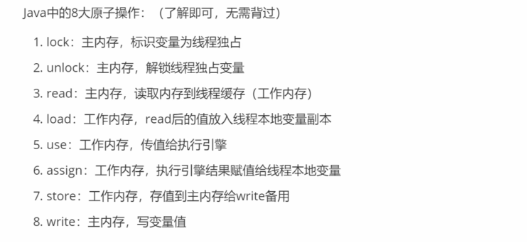

#### 2.上锁保证原子操作

上锁的本质：就是把并发编程序列化。

synchronized 保证可见性和原子性，但不保证顺序性。

```java
package com.mantou.atomicity;

import java.util.concurrent.CountDownLatch;

/**
 * @author mantou
 * @date 2021/11/10 17:06
 * @desc 原子性测试
 */
public class Plus2Test {
    private static long n = 0L ;

    public static void main(String[] args) throws InterruptedException {
        Thread[] threads = new Thread[100] ;
        CountDownLatch latch = new CountDownLatch(threads.length);
        for (int i = 0; i < threads.length; i++) {
            threads[i] = new Thread(() -> {
                for (int j = 0; j < 10000; j++) {
                    synchronized (Plus2Test.class) {    //上锁保证原子操作，被当成一个整体，不可打断
                        n++;    // 不是原子操作，会导致线程争抢
                    }

                }
                latch.countDown();
            });
        }

        for (Thread thread : threads) {
            thread.start();
        }

        latch.await();

        System.out.println(n);   //974571

    }
}
```

锁中的概念：

```java
private static Object o = new Object() ;    // monitor（管程）---》锁
synchronized (o) {       // {}内为临界区
    ....;
}

```

如果临界区代码执行时间长，代码语句多，则说锁的粒度粗。反之，则说锁的粒度细。

保证原子性的两种方式：


其中，乐观锁又称自旋锁或无锁。

#### 3.CAS

1. CAS概念

   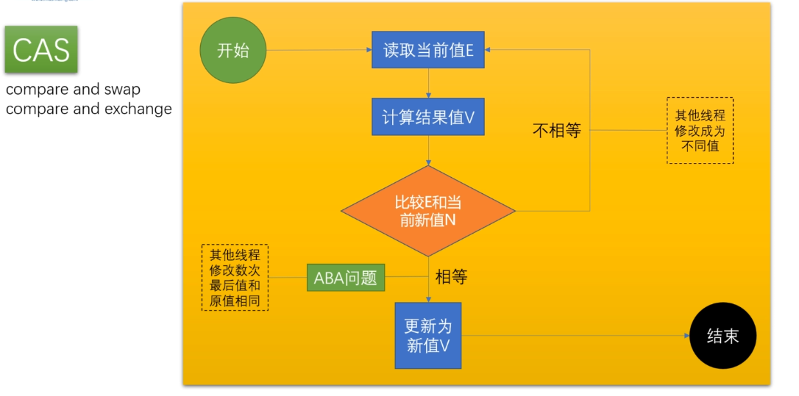

2. ABA问题

   中途被别的线程修改，然后又改回去，对于引用数据类型，可能内容发生了变化。

   解决ABA问题，可以加version，每个线程修改version加1。

3. CAS实现n++代码

   通过Atomic类实现CAS

   ```java
   package com.mantou.atomicity;
   
   import java.util.ArrayList;
   import java.util.List;
   import java.util.concurrent.atomic.AtomicInteger;
   
   /**
    * @author mantou
    * @date 2021/11/10 18:05
    * @desc CAS
    */
   public class CASTest {
       AtomicInteger count = new AtomicInteger();
       void m() {
           for (int i = 0; i < 10000 ; i++) {
               count.incrementAndGet();    //代替count++
           }
       }
       public static void main(String[] args) {
           CASTest casTest = new CASTest() ;
           List<Thread> threads = new ArrayList<>();
   
           for (int i = 0; i < 100; i++) {
              threads.add(new Thread(casTest::m,"t" + i));
           }
   
           threads.forEach((o) -> o.start());
   
           threads.forEach((o) -> {
               try {
                   o.join();
               } catch (InterruptedException e) {
                   e.printStackTrace();
               }
           });
   
           System.out.println(casTest.count);
   
       }
   }
   ```

   4.CAS保证原子性

   CAS底层保证原子性是调用了汇编语言对CAS的支持指令，但是这条指令也不是原子操作，但是前边上了一把lock锁，所以乐观锁的本质也是一把悲观锁。

   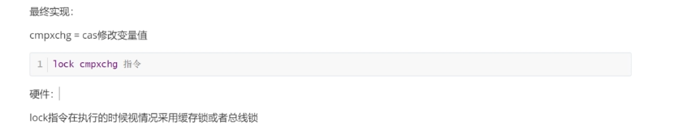

​		单核不用给指令上锁

#### 4.乐观锁和悲观锁的效率


实战使用中，就只用Synchronized就可以，因为Synchronized已经做了很多优化。

## 七丶Synchronized锁升级

### 1.markword

#### 1.JOL内存布局工具

```xml
<!-- https://mvnrepository.com/artifact/org.openjdk.jol/jol-core -->
<dependency>
	<groupId>org.openjdk.jol</groupId>
	<artifactId>jol-core</artifactId>
	<version>0.16</version>
</dependency>
```

JOL使用：

```java
package com.mantou.sync;

import org.openjdk.jol.info.ClassLayout;

/**
 * @author mantou
 * @date 2021/11/11 9:49
 * @desc JOL 对象内存布局分析工具
 */
public class HelloJol {
    public static void main(String[] args) {
        Object o = new Object() ;
        System.out.println(ClassLayout.parseInstance(o).toPrintable());

        synchronized (o) {
            System.out.println(ClassLayout.parseInstance(o).toPrintable());
        }
    }
}
```

JOL分析结果：

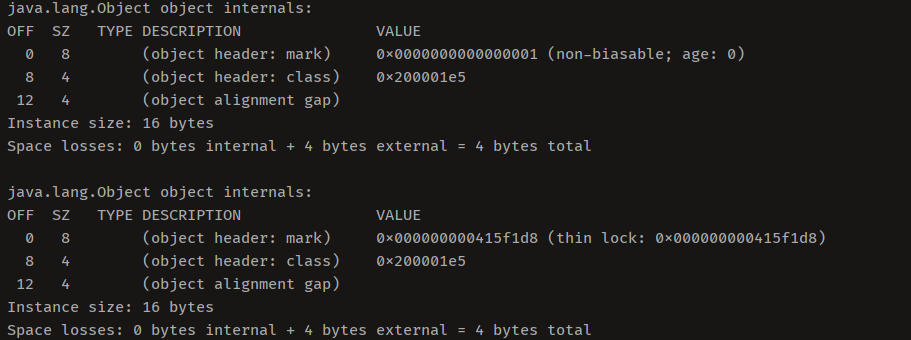

结果分析：

​	前8字节是markword记录锁信息，后边4个字节记录了类型指针，指向了class类，再后边记录成员变量等，JVM要求必须是8字节得整数倍，所以不够8字节，字节对齐，自动补充。

#### 2.JDK8 markword实现表


先看最左边最低两位，确定锁状态，如果是01则看第三位是否是偏向锁。

### 2.初步锁升级

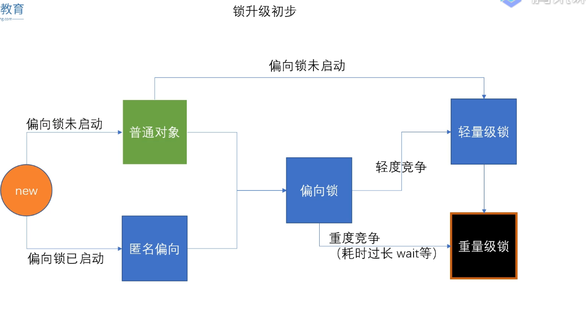

#### 1.锁区别


#### 2.偏向锁

就是在markword中记录当前线程的ID信息

#### 3.自旋锁

先撤销偏向锁的线程ID信息，在markword中指向线程栈中Lock Record的指针

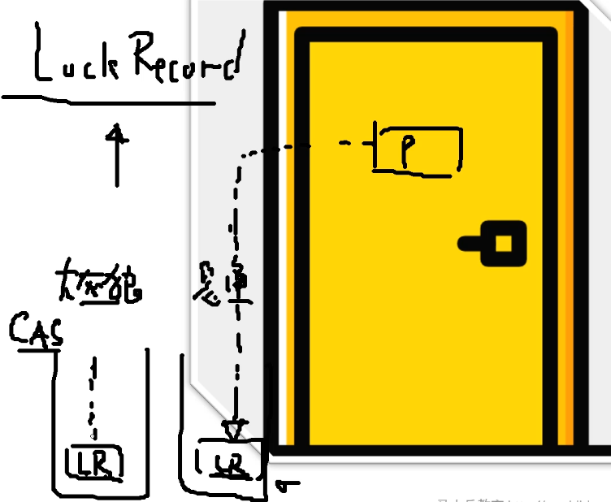

#### 4.重量级锁

需要向操作系统申请一把锁

### 3.锁重入

Synchronized是可重入锁


### 5.细节

#### 1.自旋锁什么时候升级为重量级锁？


#### 2.为什么又自选锁还需要重量级锁？

自旋是消耗CPU资源的，如果锁的时间长，或自旋的线程多，CPU会被大量消耗

重量级锁有等待队列，所有拿不到锁的线程进入等待队列，不需要消耗CPU资源

#### 3.偏向锁是否一定比自旋锁效率高？

不一定，再明确知道会有多线程竞争的情况下，偏向锁肯定会涉及锁撤销，这时候直接使用自旋锁

JVM启动过程，会有很多线程竞争（明确），所以默认情况启动时不打开偏向锁，过一段时间再打开


```java
package com.mantou.sync;

import com.mantou.utils.SleepHelper;
import org.openjdk.jol.info.ClassLayout;

/**
 * @author mantou
 * @date 2021/11/11 14:36
 * @desc 偏向锁启动时延
 */
public class BiasedLockTest {
    public static void main(String[] args) {
       // SleepHelper.sleepSeconds(5);
        Object o = new Object();
        System.out.println(ClassLayout.parseInstance(o).toPrintable());
    }
}
```

运行结果：(没有启动偏向锁)

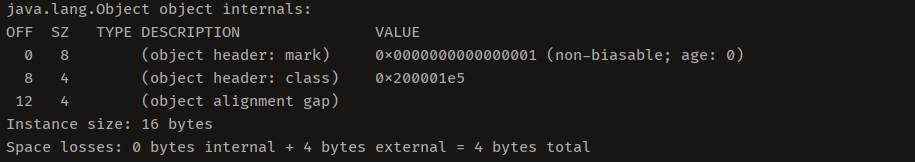

```java
package com.mantou.sync;

import com.mantou.utils.SleepHelper;
import org.openjdk.jol.info.ClassLayout;

/**
 * @author mantou
 * @date 2021/11/11 14:36
 * @desc 偏向锁启动时延
 */
public class BiasedLockTest {
    public static void main(String[] args) {
        SleepHelper.sleepSeconds(5);
        Object o = new Object();
        System.out.println(ClassLayout.parseInstance(o).toPrintable());
    }
}
```

运行结果:（启动了偏向锁,是一个匿名偏向锁）

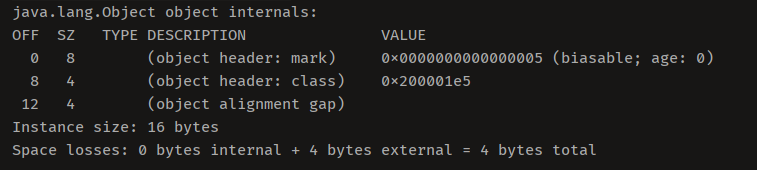

## 八丶线程池

### 1.常用线程池的体系

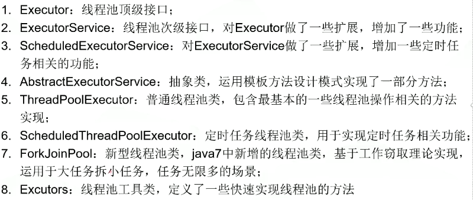

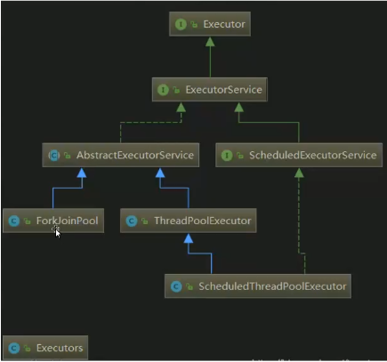

### 2.Executor

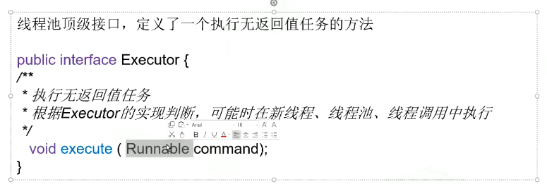

### 3.ExecutorService

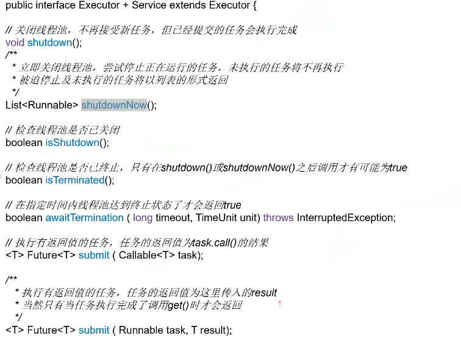

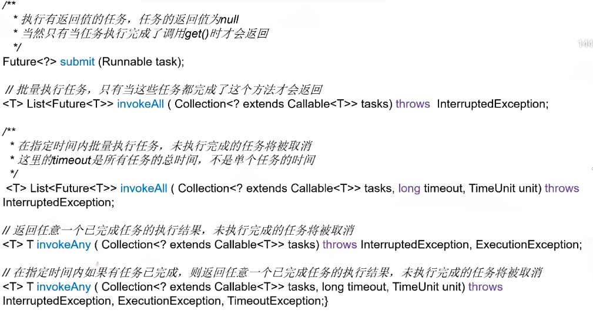

