# 集合

## 一丶Collection接口

### 1.Collection接口常用方法

```java
package com.mantou.collection;

import java.util.ArrayList;
import java.util.Collection;

/**
 * @author mantou
 * @date 2021/11/1 13:52
 * @return
 * @desc collection接口
 *       集合的特点，集合只能存储引用数据类型数据，基本数据类型会自动装箱存储。
 */
public class CollectionTest {
    public static void main(String[] args) {
        Collection collection = new ArrayList();
        Collection collection1 = new ArrayList();
        //1.增加功能   add(E e)   addAll(Collection<? extends E> c)
        collection.add(15);
        collection.add(12);
        collection.add(6);
        collection.add("mantou");
        System.out.println(collection.toString());    //[15, 12, 6, mantou]

        collection1.add(6);
        collection1.add("mantou");

        collection.addAll(collection1);

        System.out.println(collection.toString());  // [15, 12, 6, mantou, 6, mantou]

        //2.判断功能   contains(Object o)  equals(Object o)  isEmpty()
        System.out.println(collection.contains("mantou"));   //true
        System.out.println(collection.containsAll(collection1));  //true
        System.out.println(collection.equals(collection1)); //false
        System.out.println(collection.isEmpty());  //false
        //3.查看功能   size()
        System.out.println(collection.size());    //   6
        //4.转换功能   toArray()
        System.out.println(collection.toArray()[0]);  //  15
        //5.删除功能   clear()   remove(Object o)
        System.out.println(collection.remove("mantou"));  //true
        collection.clear();
        System.out.println(collection.size()); //   0
    }
}

```

### 2.遍历collection

```java
package com.mantou.collection;

import java.util.ArrayList;
import java.util.Collection;
import java.util.Iterator;

/**
 * @author mantou
 * @date 2021/11/1 14:15
 * @return
 * @desc 遍历collection集合
 */
public class CollectionTest02 {
    public static void main(String[] args) {
        Collection collection = new ArrayList();
        collection.add("zhangsan");
        collection.add("lisi");
        collection.add("wangwu");
        collection.add("zhaoliu");
        //方式1：普通for循环   , 没有获取元素的方法，所以不能使用普通for循环

        //方式2：增强for循环
        for (Object c: collection) {
            System.out.println(c);
        }
        //方式3：迭代器
        Iterator iterator = collection.iterator();
        while (iterator.hasNext()){
            System.out.println(iterator.next());
        }
    }
}
```

### 3.实现类

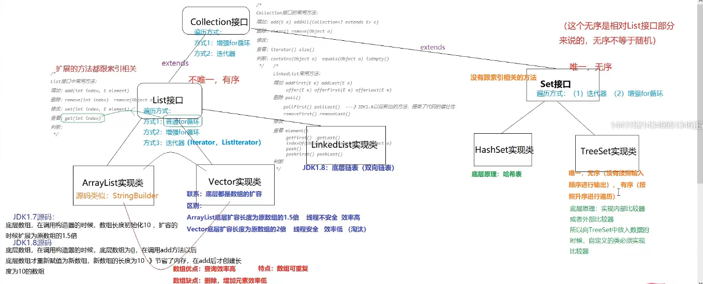

## 二丶List接口

### 1.List接口常用方法

```java
package com.mantou.list;

import java.util.ArrayList;
import java.util.List;

/**
 * @author mantou
 * @date 2021/11/1 14:34
 * @return
 * @desc List接口常用方法
 */
public class ListTest01 {
    public static void main(String[] args) {
        List list = new ArrayList();
        list.add(3);
        list.add(5);
        list.add("mantou");
        //1.增加功能  add(int index, E element)
        list.add(2,"lisi");
        //2.查看功能  get(int index)
        System.out.println(list.get(2));   //lisi
        //3.修改功能
        System.out.println(list.set(2, "wangwu"));  // lisi
        //4.删除功能  remove(int index)
        System.out.println(list.remove(2));  //wangwu
    }
}
```

### 2.遍历List

```java
//1.普通for循环
for (int i = 0; i < list.size(); i++) {
    System.out.println(list.get(i));
}
//2.增强for循环
for (Object o : list) {
    System.out.println(o);
}
//3.迭代器
Iterator iterator = list.iterator();
while (iterator.hasNext()){
    System.out.println(iterator.next());
}
```

## 三丶ArrayList集合

### 1.ArrayList源码区别

```
* JDK1.7是创建时初始化长度为10，之后每次扩容为之前的1.5倍
* JDK1.8是调用add方法的时候才会初始化长度为10
```

### 2.ArrayList与Vector的区别

```
*  arraylist扩容为实际数组长度的1.5倍  线程不安全  效率高
*  vector 扩容为实际数组长度的2倍   线程安全   效率低 （已经淘汰）
```

## 四丶LinkedList集合

### 1.LinkedList的常用API和遍历

```java
package com.mantou.list;

import java.util.Iterator;
import java.util.LinkedList;

/**
 * @author mantou
 * @date 2021/11/2 14:20
 * @desc LinkedList 常用API
 * 注意：尽量使用JDK1.6之后更新的增删改查接口，因为增强了健壮性，例如空链表使用remove方法会报错，但是使用poll不会
 * 总结：增加使用offer 查看使用peek 删除使用poll
 */
public class LinkedListTest {
    public static void main(String[] args) {
        LinkedList<String> list = new LinkedList<>();
        //1.增加 add(E e) add(int index, E element) addFirst(E e) addLast(E e)  JDK1.6之前的接口
        // offer(E e)  offerFirst(E e)  offerLast(E e)  JDK1.6 的接口
        list.add("zhangsan");   //添加到列表的末尾
        list.offer("mantou");   //添加到列表的末尾
        list.offerFirst("lisi");    //添加到列表前面
        list.offerLast("wangwu");   //添加到列表末尾
        System.out.println(list.toString());   // [lisi, zhangsan, mantou, wangwu]
        //2.修改  set(int index, E element)
        list.set(1,"zhaoliu");
        //3.查看  get(int index) getFirst() getLast() size()
        System.out.println(list.get(1));
        System.out.println(list.getFirst());
        System.out.println(list.getLast());
        //peek() peekFirst() peekLast()
        System.out.println(list.peek());  //查找链表第一个元素
        System.out.println(list.peekFirst()); //查找链表第一个元素
        System.out.println(list.peekLast()); //查找链表最后一个元素
        //4.删除 clear()  remove(int index) removeFirst() removeLast()
        //poll() pollFirst() pollLast()
        //list.clear();   //清空链表
        //System.out.println(list.poll());  //删除链表第一个元素 ，空链表不会报错 ，返回null
        //System.out.println(list.remove()); //删除链表第一个元素, 空链表报错
        //5.判断  contains(Object o)
        System.out.println("_________________________________________");
        //遍历
        //方式1：普通for
        for (int i = 0; i < list.size(); i++) {
            System.out.println(list.get(i));
        }
        System.out.println("_________________________________________");
        //方式2：增强for
        for(String s : list) {
            System.out.println(s);
        }
        System.out.println("_________________________________________");
        //方式3：迭代器
        Iterator<String> it = list.iterator();
        while (it.hasNext()){
            System.out.println(it.next());
        }
        System.out.println("_________________________________________");
        //方式4：for循环迭代  ，这种方式更好，因为节省内存
        for (Iterator<String> it2 = list.iterator();it2.hasNext();){
            System.out.println(it2.next());
        }

    }
}
```

### 2.LinkedList底层原理

底层：使用的是双向链表

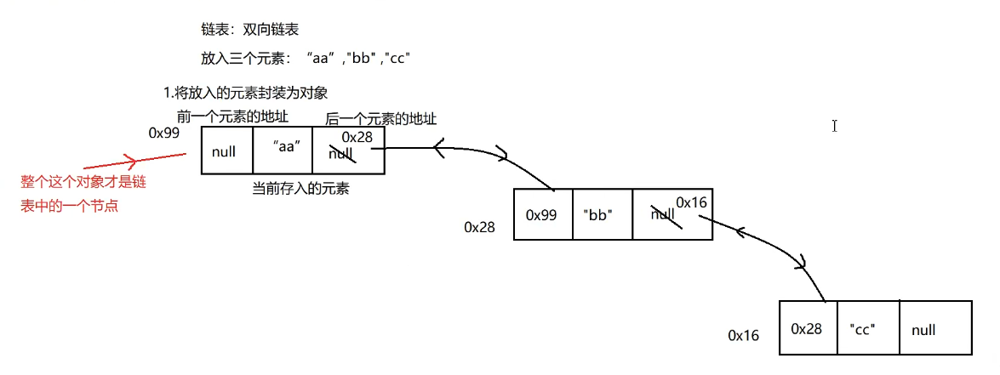

### 3.仿写LinkedList源码

Node类

```java
package com.mantou.entity;
/**
 * @author mantou
 * @date 2021/11/2 16:42
 * @desc 节点类
 */
public class Node<E> {
    /**
     * 前一个元素
     */
    private Node<E> pre ;
    /**
     * 存储的数据
     */
    private E data ;
    /**
     * 后一个元素
     */
    private Node<E> next ;

    public Node() {
    }

    public Node<E> getPre() {
        return pre;
    }

    public void setPre(Node<E> pre) {
        this.pre = pre;
    }

    public E getData() {
        return data;
    }

    public void setData(E data) {
        this.data = data;
    }

    public Node<E> getNext() {
        return next;
    }

    public void setNext(Node<E> next) {
        this.next = next;
    }

    @Override
    public String toString() {
        return "Node{" +
                "pre=" + pre +
                ", data=" + data +
                ", next=" + next +
                '}';
    }
}
```

MyLinkedList类

```java
package com.mantou.list;

import com.mantou.entity.Node;

import java.util.ArrayList;

/**
 * @author mantou
 * @date 2021/11/2 16:46
 * @desc 仿写LinkedList源码
 */
public class MyLinkedList<E> {
    /**
     * 首节点
     */
    private Node<E> first ;

    /**
     * 尾节点
     */
    private Node<E> last ;

    /**
     * 计数器
     */
    private Integer count = 0;

    /**
     * 空参构造器
     */
    public MyLinkedList() {
    }

    /**
     * add方法
     */
    public void add(E data){
        if (first == null) {    //表示这是第一个元素
            Node<E> node = new Node();
            node.setPre(null);
            node.setData(data);
            node.setNext(null);
            //当前链中第一个节点变为node
            first = node ;
            //当前最后一个节点变为node
            last = node ;
        }else{     //表示不是第一个节点了
            Node<E> node = new Node();
            node.setPre(last);
            node.setData(data);
            node.setNext(null);
            //当前链中的最后一个节点的下一个元素指向node
            last.setNext(node);
            //将最后一个节点变为n
            last = node ;
        }
        //链中元素数量增加
        count++ ;
    }

    /**
     * 获取集合中的元素数量
     */
    public Integer getSize(){
        return count ;
    }
    /**
     * 通过index获取集合中的元素
     */
    public E get(Integer index){
        //获取链表头元素
        Node<E> node = first ;
        for (int i = 0; i < index; i++) {
            node = node.getNext() ;
        }
        return (E) node.getData();
    }

}
class TestMyList{
    public static void main(String[] args) {
        MyLinkedList<String> list = new MyLinkedList<>();
        list.add("mantou");
        list.add("zhangsan");
        list.add("wangwu");
        for (int i = 0; i < list.getSize() ; i++) {
            System.out.println(list.get(i));
        }
        System.out.println(list.getSize());
    }
}
```

## 五丶Iterator

### 1.Iterator关系图

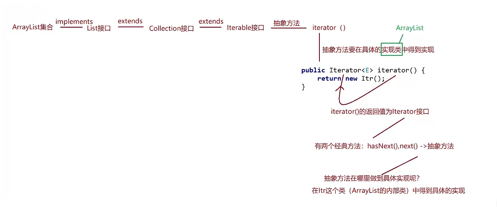

## 六丶Set集合

### 1.Hashset的特点

hashset ： 无序，唯一 ，存储自定义类型必须重写hashcode和equals方法

​					数组 + 链表

### 2.HashSet的原理图

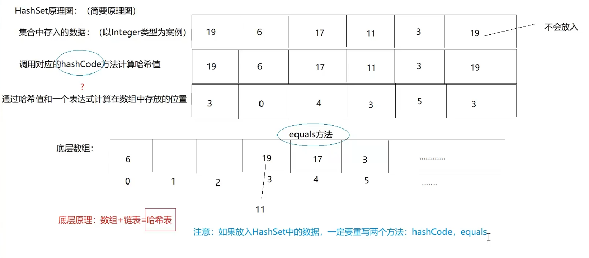

### 3.LinkedHashSet特点

LinkedHashSet：唯一，有序（按照插入顺序就行输出）

### 4.LinkedHashSet原理

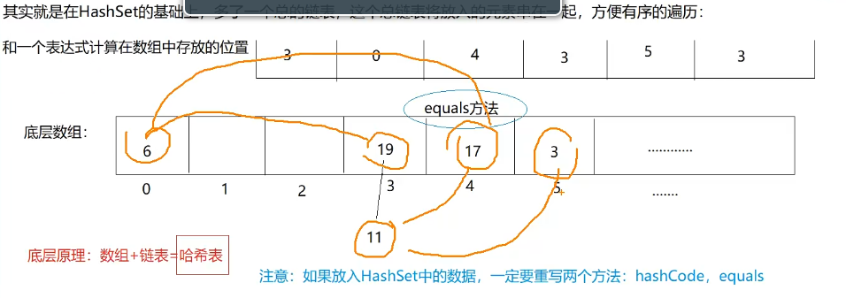

### 5.TreeSet特点

TreeSet：唯一，无序（没有按照插入顺序排序），有序（按照升序排序） 使用中序遍历

​		存储自定义类型必须重写Compare比较器方法

### 6.TreeSet原理

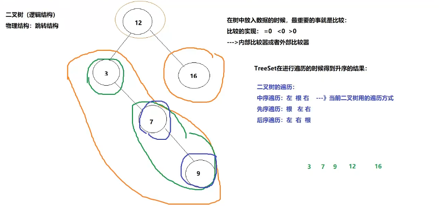

### 7.TreeSet示例

```java
package com.mantou.entity;

public class Person implements Comparable<Person>{
    private String name ;
    private Integer age ;

    public Person() {
    }

    public Person(String name, Integer age) {
        this.name = name;
        this.age = age;
    }

    public String getName() {
        return name;
    }

    public void setName(String name) {
        this.name = name;
    }

    public Integer getAge() {
        return age;
    }

    public void setAge(Integer age) {
        this.age = age;
    }

    @Override
    public String toString() {
        return "Person{" +
                "name='" + name + '\'' +
                ", age=" + age +
                '}';
    }
    //内部比较器
    @Override
    public int compareTo(Person o) {
        if(this.name.compareTo(o.getName()) == 0) {
            return this.age - o.getAge() ;
        }
        return this.name.compareTo(o.getName());
    }
}
```

```java
package com.mantou.set;

import com.mantou.entity.Person;

import java.util.Comparator;
import java.util.TreeSet;

/**
 * @author mantou
 * @date 2021/11/4 15:52
 * @desc TreeSet特点
 *
 */
public class TreeSetTest {
    public static void main(String[] args) {
        //使用内部比较器
        TreeSet<Person> treeSet = new TreeSet<>();
        treeSet.add(new Person("mantou",23));
        treeSet.add(new Person("lisi",24));
        treeSet.add(new Person("mantou",25));
        treeSet.add(new Person("zhangsan",26));
        treeSet.add(new Person("wangwu",23));
        for (Person person : treeSet) {
            System.out.println(person);
        }
        System.out.println("------------------------------------------");
        //使用外部比较器，写法为直接传入匿名内部类
        TreeSet<Person> treeSet2 = new TreeSet<>(new Comparator<Person>() {
            @Override
            public int compare(Person o1, Person o2) {
                if (o1.getName().compareTo(o2.getName()) == 0) {
                    return o1.getAge() - o2.getAge() ;
                }
                return o1.getName().compareTo(o2.getName());
            }
        });
        treeSet2.add(new Person("mantou2",23));
        treeSet2.add(new Person("lisi2",24));
        treeSet2.add(new Person("mantou2",25));
        treeSet2.add(new Person("zhangsan2",26));
        treeSet2.add(new Person("wangwu2",23));
        for (Person person : treeSet2) {
            System.out.println(person);
        }
    }
}
```

## 七丶比较器的使用

### 1.内部比较器

```java
package com.mantou.entity;

public class Student implements Comparable<Student>{

    private String name ;
    private Integer age ;

    public Student() {
    }

    public Student(String name, Integer age) {
        this.name = name;
        this.age = age;
    }

    public String getName() {
        return name;
    }

    public void setName(String name) {
        this.name = name;
    }

    public Integer getAge() {
        return age;
    }

    public void setAge(Integer age) {
        this.age = age;
    }

    @Override
    public String toString() {
        return "Student{" +
                "name='" + name + '\'' +
                ", age=" + age +
                '}';
    }

    //内部比较器
    @Override
    public int compareTo(Student o) {
        if(this.name.compareTo(o.name) == 0) {
            return this.age - o.age ;
        }
        return this.name.compareTo(o.name);
    }
}
```

### 2.外部比较器

```java
package com.mantou.compare;

import com.mantou.entity.Student;

import java.util.Comparator;
/**
 * @author mantou
 * @date 2021/11/4 14:56
 * @desc 外部比较器
 */
public class StudentCompare implements Comparator<Student> {

    @Override
    public int compare(Student o1, Student o2) {
        if (o1.getName().compareTo(o2.getName()) == 0) {
            return o1.getAge() - o2.getAge() ;
        }
        return o1.getName().compareTo(o2.getName()) ;
    }
}
```

### 3.比较器测试类

```java
package com.mantou.compare;

import com.mantou.entity.Student;
import java.util.Arrays;
import java.util.Comparator;

/**
 * @author mantou
 * @date 2021/11/4 14:41
 * @desc 比较器的使用
 * 外部比较器可以使用多态，所以扩展性更好
 */
public class CompareTest {
    public static void main(String[] args) {
        //使用内部比较器比较自定义对象
        Student stu1 = new Student("wangwu",23);
        Student stu2 = new Student("mantou",24);
        Student stu3 = new Student("mantou",25);
        Student stu4 = new Student("mantou", 23);
        Student[] students = new Student[] {stu1,stu2,stu3,stu4} ;
        Arrays.sort(students);
        for (Student student : students) {
            System.out.println(student);
        }
        System.out.println("-------------------------------------------");
        //使用外部比较器比较自定义对象
        Comparator<Student> comparator = new StudentCompare();
        Student[] students2 = new Student[] {stu1,stu2,stu3,stu4} ;
        Arrays.sort(students2 , new StudentCompare());
        for (Student student : students2) {
            System.out.println(student);
        }

    }
}
```

## 八丶Map接口

### 1.Map集合常用API

HashMap的key如果是自定义类型，则必须实现hashcode和equals

TreeMap的key如果是自定义类型，则必须实现compare比较器（内部比较器/外部比较器）

```java
package com.mantou.map;

import java.util.Collection;
import java.util.HashMap;
import java.util.Map;
import java.util.Set;

/**
 * @author mantou
 * @date 2021/11/4 16:49
 * @desc Map集合常用方法
 * Map集合的特点：无序，唯一，key唯一  value不唯一
 *
 */
public class MapTest {
    public static void main(String[] args) {
        Map<String,Integer> map = new HashMap<>();
        //添加 put(K key, V value)
        map.put("mantou",111);
        map.put("zhangsan",222);
        map.put("lisi",333);
        map.put("wangwu",444);
        map.put("zhaoliu",555);
        System.out.println(map);
        //查找 entrySet() get(Object key) size() keySet()   values()
        System.out.println(map.get("mantou"));
        System.out.println(map.size());
        //遍历集合的所有key
        Set<String> strings = map.keySet();
        for (String string : strings) {
            System.out.println(string);
        }
        //遍历集合的所有值
        Collection<Integer> values = map.values();
        for (Integer value : values) {
            System.out.println(value);
        }
        //遍历集合的所有键值对
        Set<Map.Entry<String, Integer>> entries = map.entrySet();
        for (Map.Entry<String, Integer> entry : entries) {
            System.out.println(entry.getKey() + ":" + entry.getValue());
        }


        Map<String,Integer> map2 = new HashMap<>();
        //添加 put(K key, V value)
        map2.put("mantou",111);
        map2.put("zhangsan",222);
        map2.put("lisi",333);
        map2.put("wangwu",444);
        map2.put("zhaoliu",555);

        //判断 containsKey(Object key) containsValue(Object value) equals(Object o) isEmpty()
        System.out.println(map == map2);
        System.out.println(map.equals(map2));
        System.out.println(map.containsKey("mantou"));
        System.out.println(map.containsValue(222));
        //删除  clear() remove(Object key)
        map.clear();
        System.out.println(map);
        map2.remove("mantou");
        System.out.println(map2);
    }
}
```

### 2.HashTable集合

特点：API与HashMap相同，但是线程安全，效率低，key不可以为null，而HashMap的key值可以为null，并且唯一

### 3.LinkedHashMap集合

特点：唯一，有序（按照输入顺序输出），底层哈希表+链表

### 4.TreeMap集合

特点：key按照比较器规则升序/降序排序，key唯一

底层：哈希表 + 二叉树

```java
package com.mantou.map;

import com.mantou.entity.Car;

import java.util.Comparator;
import java.util.Map;
import java.util.TreeMap;
/**
 * @author mantou
 * @date 2021/11/4 19:26
 * @desc TreeMap集合
 *  TreeMap集合 key必须实现比较器接口
 *  key唯一且key按照比较器规则排序
 */
public class TreeMapTest {
    public static void main(String[] args) {
        Map<Car,Integer> map = new TreeMap<>(new Comparator<Car>() {
            @Override
            public int compare(Car c1, Car c2) {
                if (c1.getName().compareTo(c2.getName()) == 0)
                    return c1.getPrice() - c2.getPrice() ;
                return c1.getName().compareTo(c2.getName());
            }
        });
        map.put(new Car("C布加迪",20000000),1);
        map.put(new Car("A奥迪",100000),2);
        map.put(new Car("A奥迪",200000),3);
        map.put(new Car("B奔驰",300000),4);
        map.put(new Car("C宝马",200000),5);
        map.put(new Car("A奥迪",100000),6);
        System.out.println(map);
    }
}
```

### 5.HashMap集合

#### 1.HashMap原理

底层：数组 + 链表  = 哈希表


总结：先用键值对的key通过hashCode方法计算出哈希码，然后再根据哈希码计算出主数组的下标，然后把键值对封装成Entry对象，存入Entry数组中。如果产生hash冲突，则比较内容是否相同，如果相同，则使用后一个的value替换前面一个元素的value。如果内容不同，则形成链表，JDK7采用前插法，后来的插前面,JDK8采用后插法，后来的插后面。

#### 2.HashMap重要属性

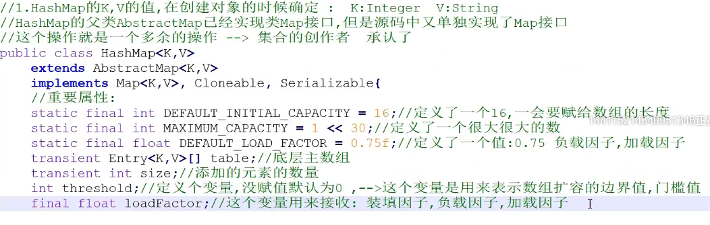

#### 3.HashMap构造器

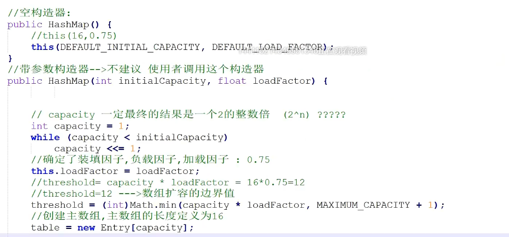

#### 4.HashMap中put方法

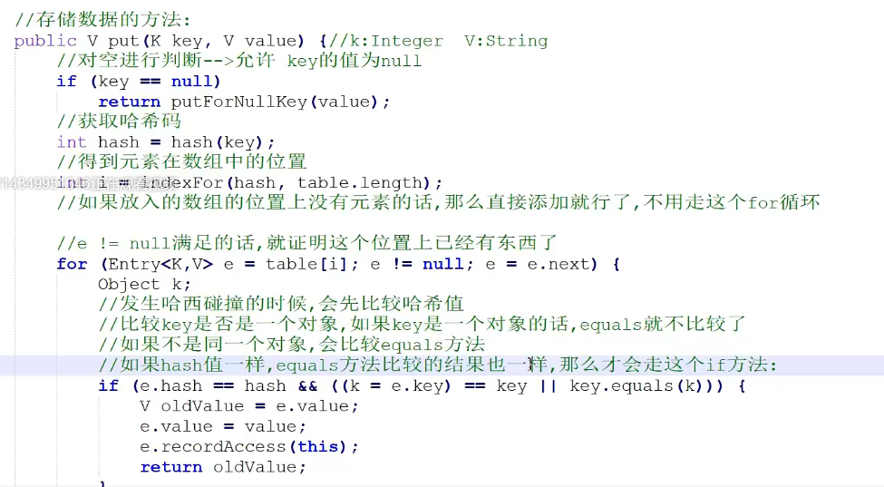

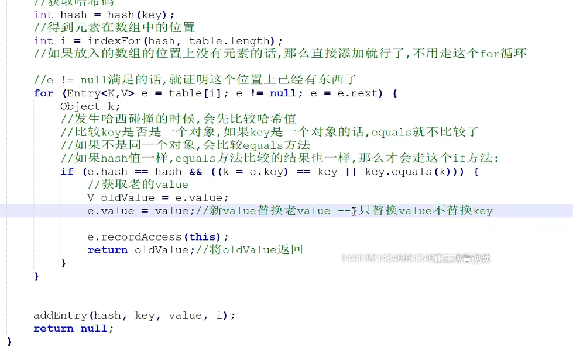

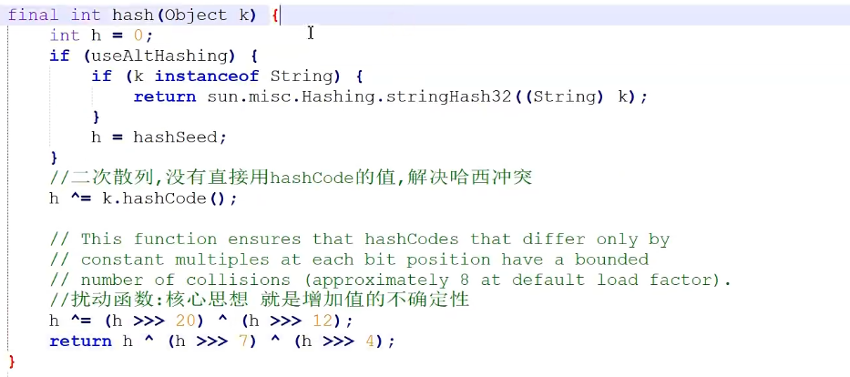

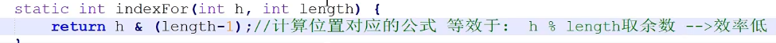

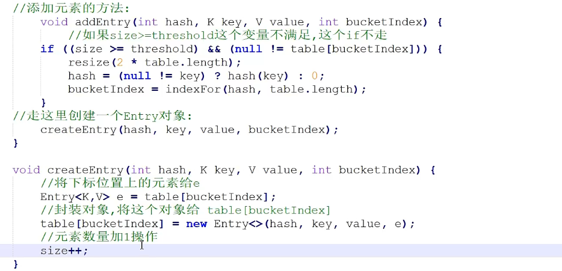

#### 5.HashMap扩容

如果超过扩容边界值，则进行扩容，扩容大小为原数组的2倍，老数组赋值给新数组。

#### 6.HashMap面试题

(1)负载因子为什么是0.75？

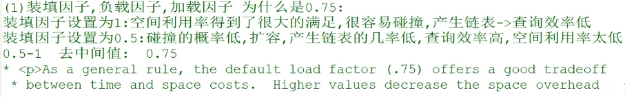

（2)主数组的长度为什么必须是2^n?

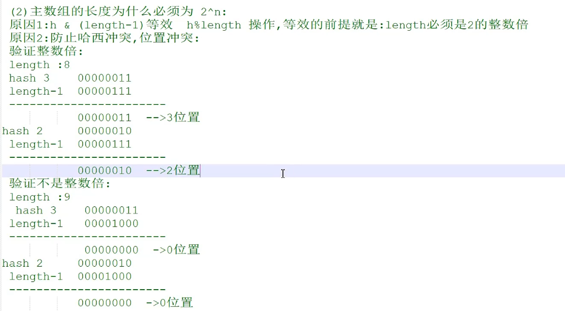

#### 7.HashMap源码JDK1.8

测试案例：

```java
package com.mantou.map;

import java.util.HashMap;

/**
 * @author mantou
 * @date 2021/11/5 14:37
 * @desc HashMap JDK1.8 实现原理
 */
public class HashMapTest {
    public static void main(String[] args) {
        HashMap<String, Integer> map = new HashMap<>(10);
        //map.put("通话", 10);
        //集合中添加元素
        System.out.println(map.put("通话", 10));
        System.out.println(map.put("随便", 20));
        System.out.println(map.put("通话", 30));
        System.out.println(map.put("重地", 40));

        System.out.println("集合元素个数:"+ map.size());
        System.out.println("集合：" + map);
    }
}
```

JDK1.8源码流程（1-33步骤）：

```java
public class HashMap<K,V> extends AbstractMap<K,V> 
	implements Map<K,V>, Cloneable, Serializable {   //1.实现了两个Map接口,重复
	//3.部分属性
	static final float DEFAULT_LOAD_FACTOR = 0.75f;     //加载因子
	final float loadFactor;     //接收加载因子
	transient Node<K,V>[] table;   //主数组
	//2.调用空参构造
	public HashMap() {
        this.loadFactor = DEFAULT_LOAD_FACTOR; // all other fields defaulted
    }
	//4.调用有参构造
	public HashMap(int initialCapacity) {
        this(initialCapacity, DEFAULT_LOAD_FACTOR);
    }
	//5.跳到这个HashMap
	public HashMap(int initialCapacity, float loadFactor) {  // 10 , 0.75
		//6.健壮性处理
        if (initialCapacity < 0)
            throw new IllegalArgumentException("Illegal initial capacity: " +
                                               initialCapacity);
        if (initialCapacity > MAXIMUM_CAPACITY)
            initialCapacity = MAXIMUM_CAPACITY;
        if (loadFactor <= 0 || Float.isNaN(loadFactor))
            throw new IllegalArgumentException("Illegal load factor: " +
                                               loadFactor);
		//7.loadFactor = 0.75
        this.loadFactor = loadFactor;
		//8.调用tableSizeFor(10)
        this.threshold = tableSizeFor(initialCapacity);
    }
	//9.tableSizeFor  这个方法确定主数组的长度   --->  这个方法的返回结果是最接近cap参数的2的n次幂
	static final int tableSizeFor(int cap) {    //10
        int n = cap - 1;
        n |= n >>> 1;
        n |= n >>> 2;
        n |= n >>> 4;
        n |= n >>> 8;
        n |= n >>> 16;
        return (n < 0) ? 1 : (n >= MAXIMUM_CAPACITY) ? MAXIMUM_CAPACITY : n + 1;
    }
	
	//10.调用put方法
	public V put(K key, V value) {   // 通话 ， 10
        return putVal(hash(key), key, value, false, true);
    }
	//11.调用hash方法
	static final int hash(Object key) {   //返回哈希码
        int h;
        return (key == null) ? 0 : (h = key.hashCode()) ^ (h >>> 16);
    }
	//12.进入putVal
	final V putVal(int hash, K key, V value, boolean onlyIfAbsent,    
                   boolean evict) {       //  哈希码，通话 ，10 ，false ，true
        Node<K,V>[] tab; Node<K,V> p; int n, i;
		//13.进入if条件，tab指向 table这个主数组
        if ((tab = table) == null || (n = tab.length) == 0)   // 证实数组类型是Node[]类型 , key 和 value 封装的是Node实例
            //14.进入resize()
			n = (tab = resize()).length;  //22.tab = newTab  n = 16
			//23.经过公式(n - 1) & hash 算出键值对存储在主数组的下标
        if ((p = tab[i = (n - 1) & hash]) == null)  //24. 进入if
            tab[i] = newNode(hash, key, value, null); //25.调用newNode方法 封装Node对象，然后赋值给tab[i] ，到此第一组键值对存入map
        else {
            Node<K,V> e; K k;  
			//27.第二组 通话键值对 产生哈希碰撞 ，进入 if
			//30.重地键值对 产生哈希碰撞 但是key不同 不进入 if
            if (p.hash == hash &&
                ((k = p.key) == key || (key != null && key.equals(k))))  //key 是 String 的好处就是不用进行后边的equals方法
                e = p;
            else if (p instanceof TreeNode)
                e = ((TreeNode<K,V>)p).putTreeVal(this, tab, hash, key, value);
            else {  //31.前两个条件都不满足，进入这个死循环
                for (int binCount = 0; ; ++binCount) {  // binCount 是桶的个数 ，尾插法
                    if ((e = p.next) == null) {  //32. p.next == null 条件满足 进入条件
                        p.next = newNode(hash, key, value, null); // 33.p.next 指向 新封装的重地的Node对象 尾插法
                        if (binCount >= TREEIFY_THRESHOLD - 1) // -1 for 1st
                            treeifyBin(tab, hash);    //如果大于8个就转化成树
                        break;
                    }
                    if (e.hash == hash &&
                        ((k = e.key) == key || (key != null && key.equals(k))))
                        break;
                    p = e;
                }
            }
			//28.e -- > p   e != null 进入 if
            if (e != null) { // existing mapping for key
                V oldValue = e.value;
                if (!onlyIfAbsent || oldValue == null)
                    e.value = value;   // 29. 将冲突的value改为新的value
                afterNodeAccess(e);
                return oldValue;   //把旧值返回
            }
        }
        ++modCount;
        if (++size > threshold)
            resize();
        afterNodeInsertion(evict);
        return null;
    }
	
	//15.进入resize()
	final Node<K,V>[] resize() {
        Node<K,V>[] oldTab = table;    //table:null    oldTap:null
        int oldCap = (oldTab == null) ? 0 : oldTab.length;   //oldCap:0
        int oldThr = threshold;	// oldThr:16
        int newCap, newThr = 0;
        if (oldCap > 0) {  //16.这个if不进入
            if (oldCap >= MAXIMUM_CAPACITY) {
                threshold = Integer.MAX_VALUE;
                return oldTab;
            }
            else if ((newCap = oldCap << 1) < MAXIMUM_CAPACITY &&
                     oldCap >= DEFAULT_INITIAL_CAPACITY)
                newThr = oldThr << 1; // double threshold
        } //17.进入这个if条件
        else if (oldThr > 0) // initial capacity was placed in threshold
            newCap = oldThr; // newCap : 16
        else {               // zero initial threshold signifies using defaults
            newCap = DEFAULT_INITIAL_CAPACITY;
            newThr = (int)(DEFAULT_LOAD_FACTOR * DEFAULT_INITIAL_CAPACITY);
        }//18.进入
        if (newThr == 0) {
            float ft = (float)newCap * loadFactor;  // 16 * 0.75 = 12   ft = 12
            newThr = (newCap < MAXIMUM_CAPACITY && ft < (float)MAXIMUM_CAPACITY ?
                      (int)ft : Integer.MAX_VALUE);  // newThr : 12
        }
        threshold = newThr;  //threshold = 12
        @SuppressWarnings({"rawtypes","unchecked"})
		//19.创建了一个长度为16的Node数组
        Node<K,V>[] newTab = (Node<K,V>[])new Node[newCap];
        table = newTab;  //20.主数组长度确定为16
        if (oldTab != null) {   //21.这个if不进入
            for (int j = 0; j < oldCap; ++j) {
                Node<K,V> e;
                if ((e = oldTab[j]) != null) {
                    oldTab[j] = null;
                    if (e.next == null)
                        newTab[e.hash & (newCap - 1)] = e;
                    else if (e instanceof TreeNode)
                        ((TreeNode<K,V>)e).split(this, newTab, j, oldCap);
                    else { // preserve order
                        Node<K,V> loHead = null, loTail = null;
                        Node<K,V> hiHead = null, hiTail = null;
                        Node<K,V> next;
                        do {
                            next = e.next;
                            if ((e.hash & oldCap) == 0) {
                                if (loTail == null)
                                    loHead = e;
                                else
                                    loTail.next = e;
                                loTail = e;
                            }
                            else {
                                if (hiTail == null)
                                    hiHead = e;
                                else
                                    hiTail.next = e;
                                hiTail = e;
                            }
                        } while ((e = next) != null);
                        if (loTail != null) {
                            loTail.next = null;
                            newTab[j] = loHead;
                        }
                        if (hiTail != null) {
                            hiTail.next = null;
                            newTab[j + oldCap] = hiHead;
                        }
                    }
                }
            }
        }
        return newTab;
    }
	
	//26.封装Node对象
	Node<K,V> newNode(int hash, K key, V value, Node<K,V> next) {
        return new Node<>(hash, key, value, next);
    }
	
	
	//如果链表大于8个元素则进行树化
	final void treeifyBin(Node<K,V>[] tab, int hash) {
        int n, index; Node<K,V> e;
        if (tab == null || (n = tab.length) < MIN_TREEIFY_CAPACITY)    // 链表元素大于8并且主数组的长度大于64 才进行树化
            resize();
        else if ((e = tab[index = (n - 1) & hash]) != null) {
            TreeNode<K,V> hd = null, tl = null;
            do {
                TreeNode<K,V> p = replacementTreeNode(e, null);
                if (tl == null)
                    hd = p;
                else {
                    p.prev = tl;
                    tl.next = p;
                }
                tl = p;
            } while ((e = e.next) != null);
            if ((tab[index] = hd) != null)
                hd.treeify(tab);
        }
    }
}
```

