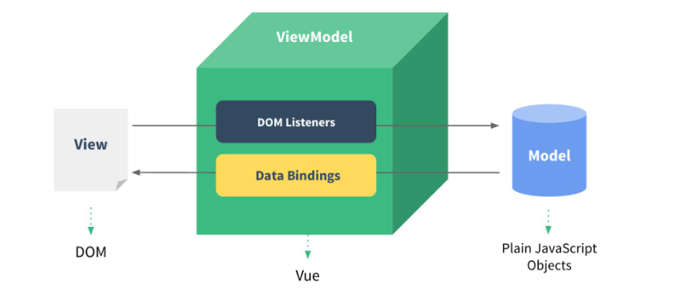
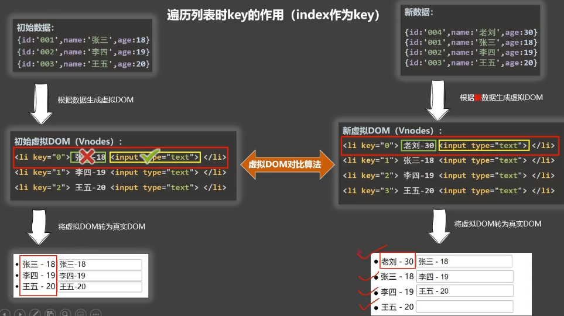

# Vue学习笔记

## 一丶Vue基本语法

### 1.初识Vue

```vue
<!DOCTYPE html>
<html lang="en">
<head>
  <meta charset="UTF-8">
  <title>Hello</title>
  <script type="text/javascript" src="../js/vue.js"></script>
</head>
<body>
  <div id="root">
    Hello,{{name}}     //插值语法
    <hr/>
    <a :href="baidu">跳转百度</a>  //指令语法
  </div>
</body>
<script type="text/javascript">
  Vue.config.productionTip = false ;    //阻止vue启动时的生产提示。
  new Vue({
    el:"#root",
    data:{
      name:"馒头",
      baidu:"http://www.baidu.com"
    }
  })
</script>
</html>
```

### 2.模板语法

（1）插值语法

​	功能：用于指定标签体内容

```vue
<!DOCTYPE html>
<html lang="en">
<head>
  <meta charset="UTF-8">
  <title>插值语法</title>
  <script type="text/javascript" src="../js/vue.js"></script>
</head>
<body>
  <div id="root">
    Hello,{{name}}     //插值语法
  </div>
</body>
<script type="text/javascript">
  Vue.config.productionTip = false ;    //阻止vue启动时的生产提示。
  new Vue({
    el:"#root",
    data:{
      name:"馒头",
    }
  })
</script>
</html>
```

（2）指令语法

​	功能：用于解析标签

```vue
<!DOCTYPE html>
<html lang="en">
<head>
  <meta charset="UTF-8">
  <title>指令语法</title>
  <script type="text/javascript" src="../js/vue.js"></script>
</head>
<body>
  <div id="root">
    <a v-bind:href="baidu.toUpperCase()">跳转百度</a>  //指令语法
    <a :href="baidu">跳转百度</a>  //指令语法
  </div>
</body>
<script type="text/javascript">
  Vue.config.productionTip = false ;    //阻止vue启动时的生产提示。
  new Vue({
    el:"#root",
    data:{
      name:"馒头",
      baidu:"http://www.baidu.com"
    }
  })
</script>
</html>
```

### 3.数据绑定

#### 1.单向数据绑定

v-bind指令：数据只能从数据流向页面。

v-bind的简写形式是：

#### 2.双向数据绑定

v-model指令，只能应用在表单类元素中，带有value值的元素。数据不仅能从数据流向页面，而且能从页面流向数据。

v-model:value 的简写形式是 v-model

### 4.el和data的两种写法

```vue
<!DOCTYPE html>
<html lang="en">
<head>
    <meta charset="UTF-8">
    <meta http-equiv="X-UA-Compatible" content="IE=edge">
    <meta name="viewport" content="width=device-width, initial-scale=1.0">
    <title>el和data的两种写法</title>
    <script type="text/javascript" src="../js/vue.js"></script>
</head>
<body>
   <div id="root">
       你好，{{name}}
   </div>
</body>
<script>
    Vue.config.productionTip = false ;
    
    // new Vue({
    //     el:'#root',    //el第一种写法
            //data第一种写法
    //     data:{
    //         name:"馒头" 
    //     }
    // })
   
    const v = new Vue({
        //data第二种写法
        data(){
            return {
                name:"馒头"
            }
        }
    })
    setTimeout(() => {       //定时一秒再关联
        v.$mount('#root');    //el的第二种写法
    },1000);
</script>
</html>
```

### 5.理解MVVM

M：模型（Model)：data中的数据

VM:视图模型(View Model): Vue对象

V：视图(View) : DOM对象



### 6.事件处理

#### 1.事件处理

```vue
<!DOCTYPE html>
<html lang="en">
<head>
    <meta charset="UTF-8">
    <meta http-equiv="X-UA-Compatible" content="IE=edge">
    <meta name="viewport" content="width=device-width, initial-scale=1.0">
    <title>事件处理</title>
    <script type="text/javascript" src="../js/vue.js"></script>
</head>
<body>
    <div id="root">
        <button v-on:click="showInfo">点我弹窗（不传参）</button>    
        <button @click="showInfo2($event,666)">点我弹窗（传参）</button>  //简写形式
    </div>
</body>
<script>
    Vue.config.productionTip = false ;
    const vm = new Vue({
        el:'#root',
        data:{
            name:'馒头'
        },
        methods: {
            showInfo(event){
                console.log(event.target.innerText);
                alert(this.name);
            },
            showInfo2(event,number){
                console.log(event.target.innerText);
                alert(this.name + number);
            }
        }
    })
</script>
</html>
```

#### 2.事件修饰符

prevent：阻止默认事件

stop：阻止事件冒泡

once：事件只触发一次

capture：使用时间的捕获模式

self：只有event.target是当前操作的元素时才触发事件

passive：事件的默认行为立即执行，无需等待事件回调执行完毕

注意：修饰符可以连续写

```vue
<!DOCTYPE html>
<html lang="en">
<head>
    <meta charset="UTF-8">
    <meta http-equiv="X-UA-Compatible" content="IE=edge">
    <meta name="viewport" content="width=device-width, initial-scale=1.0">
    <title>事件修饰符</title>
    <script type="text/javascript" src="../js/vue.js"></script>
</head>
<body>
    <div id="root">
        <!-- 1.阻止默认事件 -->
        <a href="http://www.baidu.com" @click.prevent="showInfo">阻止默认事件</a>
        <!-- 2.阻止事件冒泡 -->
        <div  @click="showInfo">
            <button @click.stop="showInfo">阻止事件冒泡</button>
        </div>
        <!-- 3.事件只触发一次 -->
        <button @click.once="showInfo">事件只触发一次</button>
        <!-- 4.阻止事件冒泡阻止默认事件 -->
        <div  @click="showInfo">
            <a href="http://www.baidu.com" @click.stop.prevent="showInfo">阻止事件冒泡</button>
        </div>
    </div>
</body>
<script>
    Vue.config.productionTip = false ;
    const vm = new Vue({
        el:"#root",
        data:{
            name:"馒头"
        },
        methods: {
            showInfo(e){
                alert(e.target.innerText);
            }
        }
    });
</script>
</html>
```

#### 3.键盘事件

（1）键盘事件中常用的按键别名：

​	回车  =》 enter

​	删除  =》 delete  （捕获删除或退格键）

​	退出  =》 esc

​	空格 =》space 

​	换行 =》 tab 特殊，需要配合keydown使用

（2）Vue未提供别名的按键，可以使用按键原始的key值去绑定，但注意要转为kebab-case的格式

（3）系统修饰键（用法特殊）：ctrl、alt、shift、meta

​		a.配合keyup使用：按下修饰键的同时，再按下其他键，随后释放其他键。事件才会被触发。

​		b.配合keydown使用：正常触发事件。

（4）也可以使用keyCode去指定具体的按键，但是不推荐。

（5）Vue.config.keyCodes.自定义别名 = 键码。可以去定制按键别名。

注意：事件别名也能连续写

```vue
<!DOCTYPE html>
<html lang="en">
<head>
    <meta charset="UTF-8">
    <meta http-equiv="X-UA-Compatible" content="IE=edge">
    <meta name="viewport" content="width=device-width, initial-scale=1.0">
    <title>键盘事件</title>
    <script type="text/javascript" src="../js/vue.js"></script>
</head>
<body>
    <div id="root">
        按键显示输入框内容：<input type="text" @keydown.enter="showInfo">
        摁下ctrl + y 提示信息
        <input type="text" @keydown.ctrl.y="showInfo">
    </div>
</body>
<script>
    Vue.config.productionTip = false ;
    const vm  = new Vue({
        el:"#root",
        data:{
            name:"馒头"
        },
        methods: {
            showInfo(event){
                consolo.log(event.key,event.keyCode);//event.key 是键名，event.keyCode是键码。
                alert(event.target.value);
            }
        },
    });
</script>
</html>
```

### 7.计算属性

1.定义：要用的属性不存在，要通过已有属性计算得来。

2.原理： 底层借助了Object.defineproperty方法提供得getter和setter。

3.get函数什么时候执行？

​	（1).初次读取时会执行一次

​	（2).当依赖得数据发生改变时会被再次调用。

```vue
<!DOCTYPE html>
<html lang="en">
<head>
    <meta charset="UTF-8">
    <meta http-equiv="X-UA-Compatible" content="IE=edge">
    <meta name="viewport" content="width=device-width, initial-scale=1.0">
    <title>methods实现</title>
    <script type="text/javascript" src="../js/vue.js"></script>
</head>
<body>
    <div id="root">
        姓：<input type="text" v-model="firstName"> <br/><br/>
        名：<input type="text" v-model="lastName"> <br/><br/>
        全名：<span>{{fullName}}</span>     
    </div>
</body>
<script>
    Vue.config.productionTip=false;
    const vm = new Vue({
        el:"#root",
        data:{
            firstName:"馒",
            lastName:"头"
        },
        //完整写法
        // computed:{
        //     fullName:{
        //         get(){
        //             return this.firstName + '-' + this.lastName;
        //         },
        //         set(value){
        //            const arr = value.split('-') ;
        //            this.firstName = arr[0];
        //            this.lastName = arr[1];
        //         }
        //     }
        // }
        //简写形式
        computed:{
            fullName(){
                return this.firstName + "-" + this.lastName ;
            }
        }
    });
</script>
</html>
```

### 8.监视属性

监视属性watch：

1.当被监视得属性变化时，回调函数自动调用，进行相关操作。

2.监视的属性必须存在，才能进行监视。

3.监视的两种写法：

​	（1）new Vue时传入watch的配置

​	（2）通过vm.$watch监视

```vue
<!DOCTYPE html>
<html lang="en">
<head>
    <meta charset="UTF-8">
    <meta http-equiv="X-UA-Compatible" content="IE=edge">
    <meta name="viewport" content="width=device-width, initial-scale=1.0">
    <title>天气案例</title>
    <script type="text/javascript" src="../js/vue.js"></script>
</head>
<body>
    <div id="root">
        <h2>今天天气很{{info}}</h2>
        <button @click="isHot = !isHot">切换天气</button>
    </div>
</body>
<script>
    Vue.config.productionTip = false ;
    const vm = new Vue({
        el:"#root",
        data:{
            isHot:true
        },
        computed:{
            info(){
                return this.isHot ? '炎热' : '凉爽' ;
            }
        },
        //第一种写法
        // watch:{
        //     isHot:{
        //         immediate:true ,     //初始话得时候就执行一下
        //         handler(newValue,oldValue){
        //             console.log("isHot被修改了...",newValue,oldValue);
        //         }
        //     }
        // }
    })
    //第二种写法
    vm.$watch("isHot",{
        immediate:true,
        handler(newValue,oldValue){
            console.log("isHot被修改了...",newValue,oldValue);
        }
    })
</script>
</html>
```

#### 深度监视

​	1.Vue中的watcch默认不监测对象内部值的改变

​	2.配置deep：true可以监测对象内部值的改变

```vue
<!DOCTYPE html>
<html lang="en">
<head>
    <meta charset="UTF-8">
    <meta http-equiv="X-UA-Compatible" content="IE=edge">
    <meta name="viewport" content="width=device-width, initial-scale=1.0">
    <title>天气案例</title>
    <script type="text/javascript" src="../js/vue.js"></script>
</head>
<body>
    <div id="root">
        <h2>今天天气很{{info}}</h2>
        <button @click="isHot = !isHot">切换天气</button>
        <hr/>
        <span>a的值是{{numbers.a}}</span>
        <button @click="numbers.a++">点我a的值加1</button>
    </div>
</body>
<script>
    Vue.config.productionTip = false ;
    const vm = new Vue({
        el:"#root",
        data:{
            isHot:true,
            numbers:{
                a:1
            }
        },
        computed:{
            info(){
                return this.isHot ? '炎热' : '凉爽' ;
            }
        },
        //深度监视
        watch:{
            numbers:{
                deep:true,    //开启深度监视
                handler(newValue,oldValue){
                    console.log("a的值改变了",newValue.a);
                } 
            }
        }
    })
    
</script>
</html>
```

### 9.计算属性和监视属性的区别

1.computed能完成的功能，watch都能完成。

2.watch能完成的功能，computed不一定能完成。例如：watch可以调用异步函数。

原则：Vue所管理的函数，最好都写成普通函数。不是Vue所管理的对象最好都写成箭头函数。

### 10.绑定class样式

方式有三种：

1.字符串写法，适用于：样式的类名不确定，需要动态指定

2.数组写法，适用于：要绑定样式的个数不确定、名字也不确定

3.对象写法，适用于：要绑定样式的个数确定、名字确定，但需要动态指定

```vue
<!DOCTYPE html>
<html lang="en">
<head>
    <meta charset="UTF-8">
    <meta http-equiv="X-UA-Compatible" content="IE=edge">
    <meta name="viewport" content="width=device-width, initial-scale=1.0">
    <title>绑定样式</title>
    <script type="text/javascript" src="../js/vue.js"></script>
</head>
<style>
    .basic{
        width: 300px;
        height: 200px;
        border: 2px black solid;
    }
    .red{
        background-color: red;
    }
    .blue{
        background-color: blue;
    }
    .yellow{
        background-color: yellow;
    }
    .mantou1{
        background-color: aqua;
    }
    .mantou2{
        font-size: 50px;
    }
    .mantou3{
        border-radius: 10%;
    }
</style>
<body>
    <div id="root">
        <!-- 字符串写法，适用于：样式的类名不确定，需要动态指定 -->
        <div class="basic" :class="mood" @click="changeBackGround()">馒头</div>
        <!-- 数组写法，适用于：要绑定样式的个数不确定、名字也不确定 -->
        <div class="basic" :class="classArr" >馒头</div>
        <!-- 对象写法，适用于：要绑定样式的个数确定、名字确定，但需要动态指定 -->
        <div class="basic" :class="classObj" >馒头</div>
    </div>
</body>
<script>
    Vue.config.productionTip = false;
    const vm = new Vue({
        el:"#root",
        data:{
            mood:"red",
            classArr:['mantou1','mantou2','mantou3'],
            classObj:{
                mantou1:true,
                mantou2:false,
                mantou3:true
            }
        },
        methods:{
            changeBackGround(event){
                const arr = ['red','blue','yellow'];
                return this.mood = arr[Math.floor(Math.random()*3)];
            }
        }
    })
</script>
</html>
```

### 11.条件渲染

条件渲染:

​	1.v-if

​		适用于：切换频率比较低的场景。

​		特点：不展示的DOM元素直接删除。

​		注意：v-if可以和v-else-if、v-else一起使用，但是结构不能别打断。

​	2.v-show

​		适用于：切换频率比较高的场景。

​		特点：不展示的DOM元素不移除，仅仅隐藏。

​	备注：使用v-if时，元素可能无法获取到，而使用v-show一定可以获取到。

```vue
<!DOCTYPE html>
<html lang="en">
<head>
    <meta charset="UTF-8">
    <meta http-equiv="X-UA-Compatible" content="IE=edge">
    <meta name="viewport" content="width=device-width, initial-scale=1.0">
    <title>条件渲染</title>
    <script src="../js/vue.js"></script>
</head>
<body>
    <div id="root">
        <!-- v-show相当于style='display:none',dom结构还有，只是不显示。 -->
        <div v-show="false">欢迎,{{name}}</div>  
        <!-- v-if直接干掉了dom元素 -->
        <div v-if="false">欢迎,{{name}}</div> 

        <h2>n的数值为:{{n}}</h2>
        <button @click="n++">n++</button>
        <!-- template只是占位符，不占dom，只能用v-if，不能用v-show -->
        <template v-if="n == 1">
            <h2>vue</h2>
            <h2>java</h2>
            <h2>php</h2>
        </template>
        <!-- 下边是一个整体，中间不能穿插别的代码 -->
        <div v-if="n==1">馒头</div>
        <div v-else-if="n==2">肉饼</div>
        <div v-else>窝头</div>
    </div>
</body>
<script>
    Vue.config.productionTip = false;
    const vm = new Vue({
        el:"#root",
        data:{
            name:"馒头",
            n:0
        }
    });
</script>
</html>
```

### 12.列表渲染

#### 1.基本列表

v-for指令：

​	1.用于展示列表数据

​	2.可遍历：数组、对象、字符串（用的少）、指定次数（用的少）

```vue
<!DOCTYPE html>
<html lang="en">
<head>
    <meta charset="UTF-8">
    <meta http-equiv="X-UA-Compatible" content="IE=edge">
    <meta name="viewport" content="width=device-width, initial-scale=1.0">
    <title>列表渲染</title>
    <script src="../js/vue.js"></script>
</head>
<body>
    <div id="root">
        <h2>遍历数组</h2>
        <ul>
            <li v-for="(person,index) in persons" ::key="index">
                {{person}} -- {{index}}
            </li>
        </ul>
        <h2>遍历对象</h2>
        <ul>
            <li v-for="(name,value) in car" :key="value">
                {{value}} -- {{name}}
            </li>
        </ul>
        <h2>遍历字符串</h2>
        <ul>
            <li v-for="(char,index) in userName" :key="index">
                {{index}} -- {{char}}
            </li>
        </ul>
        <h2>遍历指定次数</h2>
        <ul>
            <li v-for="(number,index) in 5" :key="index">
                {{index}} -- {{number}}
            </li>
        </ul>
    </div>
</body>
<script>
    Vue.config.productionTip = false ;
    const  vm = new Vue({
        el:"#root",
        data:{
            persons:[
                {id:"001",name:"馒头",age:"18"},
                {id:"002",name:"肉饼",age:"19"},
                {id:"001",name:"猪头",age:"20"}
            ],
            car:{
                carName:"奔驰",
                price:"200w",
                color:"黑色"
            },
            userName:"mantou"
        }
    });
</script>
</html>
```

#### 2.key的原理和作用

原理:



错误演示:

```vue
<!DOCTYPE html>
<html lang="en">
<head>
    <meta charset="UTF-8">
    <meta http-equiv="X-UA-Compatible" content="IE=edge">
    <meta name="viewport" content="width=device-width, initial-scale=1.0">
    <title>key的作用和原理</title>
    <script src="../js/vue.js"></script>
</head>
<body>
    <div id="root">
        <h2>index作为key会出现的问题</h2>
        <ul>
            <li v-for="(person,index) in persons" :key="index">
                {{person.name}}-{{person.age}}
                <input type="text" > 
                <span>（输入框中输入名字）</span>
                <br>
            </li>
        </ul>
    
        <hr>
        <h2>使用唯一标识当作key</h2>
        <ul>
            <li v-for="(person,index) in persons" :key="person.id">
                {{person.name}}-{{person.age}}
                <input type="text" > 
                <span>（输入框中输入名字）</span>
                <br>
            </li>
        </ul>
        <button @click.once="addPerson()">点击增加人员</button>
    </div>
</body>
<script>
    Vue.config.productionTip = false;
    const vm = new Vue({
        el:"#root",
        data:{
            persons:[
                {id:"001",name:"馒头",age:"18"},
                {id:"002",name:"肉饼",age:"19"},
                {id:"001",name:"猪头",age:"20"}
            ]
        },
        methods:{
            addPerson(){
                const person = {id:"004",name:"张三",age:"30"}
                //this.persons.push(person);   从后面插入数据
                this.persons.unshift(person);   //从前面插入数据
            }
        }
    });
</script>
</html>
```

#### 3.列表过滤

```vue
<!DOCTYPE html>
<html lang="en">
<head>
    <meta charset="UTF-8">
    <meta http-equiv="X-UA-Compatible" content="IE=edge">
    <meta name="viewport" content="width=device-width, initial-scale=1.0">
    <title>列表过滤</title>
    <script src="../js/vue.js"></script>
</head>
<body>
    <div id="root">
        搜索：<input type="text" v-model="keyWord" />
        <ul>
            <li v-for="(person,index) in filPersons" :key="person.id"> 
                {{person.name}}-{{person.age}}
            </li>
        </ul>
    </div>
</body>
<script>
    Vue.config.productionTip = false;
    //监视属性实现
    // const vm = new Vue({
    //     el:"#root",
    //     data:{
    //         keyWord:"",
    //         persons:[
    //             {id:"001",name:"马冬梅",age:"18"},
    //             {id:"002",name:"周冬雨",age:"19"},
    //             {id:"003",name:"周杰伦",age:"20"},
    //             {id:"004",name:"温兆伦",age:"21"}
    //         ],
    //         filPersons:[]
    //     },
    //     //监视属性实现
    //     watch:{
    //         keyWord:{
    //             immediate:true,
    //             handler(val){
    //                 this.filPersons = this.persons.filter((person)=>{
    //                 return person.name.indexOf(val) != -1;
    //             })
    //             }
    //         }
    //     }

    // });
    //计算属性实现
    const vm = new Vue({
        el:"#root",
        data:{
            keyWord:"",
            persons:[
                {id:"001",name:"马冬梅",age:"18"},
                {id:"002",name:"周冬雨",age:"19"},
                {id:"003",name:"周杰伦",age:"20"},
                {id:"004",name:"温兆伦",age:"21"}
            ]
        },
        computed:{
            filPersons(){
                return this.persons.filter((person)=>{
                    return person.name.indexOf(this.keyWord) != -1;
                 })
             }
        }
    });
</script>
</html>
```

#### 4.列表排序

```vue
<!DOCTYPE html>
<html lang="en">
<head>
    <meta charset="UTF-8">
    <meta http-equiv="X-UA-Compatible" content="IE=edge">
    <meta name="viewport" content="width=device-width, initial-scale=1.0">
    <title>列表排序</title>
    <script src="../js/vue.js"></script>
</head>
<body>
    <div id="root">
        搜索：<input type="text" v-model="keyWord" />
        <button @click="sortType = 0">原顺序</button>
        <button @click="sortType = 1">升序顺序</button>
        <button @click="sortType = 2">降序顺序</button>
        <ul>
            <li v-for="(person,index) in filPersons" :key="person.id"> 
                {{person.name}}-{{person.age}}
            </li>
        </ul>
    </div>
</body>
<script>
    Vue.config.productionTip = false;
    const vm = new Vue({
        el:"#root",
        data:{
            keyWord:"",
            sortType:0,
            persons:[
                {id:"001",name:"马冬梅",age:"19"},
                {id:"002",name:"周冬雨",age:"18"},
                {id:"003",name:"周杰伦",age:"20"},
                {id:"004",name:"温兆伦",age:"21"}
            ]
        },
        computed:{
            filPersons(){
                const arr = this.persons.filter((person)=>{
                    return person.name.indexOf(this.keyWord) != -1;
                 });
                 //判断是否需要排序
                 if(this.sortType){
                     arr.sort((p1,p2)=>{
                        return this.sortType == 1 ? p1.age - p2.age : p2.age - p1.age ;
                     })
                 }
                 return arr ;
             }
        }
    })
</script>
</html>
```

### 13.收集表单数据

收集表单数据：

​	若：<input type="text" v-model.trim="userName">   ，则v-model收集的是value值，用户输入的就是value值。

​	若：<input type="radio" name="sex" svalue="male" v-model="sex">，则v-model收集的是value值，且要给标签设置value值。

​	若：<input type="checkbox" value="learn" v-model="hobby">

​		1.没有配置input的value属性，那么收集的就是checked。（是布尔值）

​		2.配置input的value值：

​			（1）v-model的初始值是非数组，那么收集的就是checked

​			（2）v-model的初始值是数组，那么收集的就是value组成的组数

​	备注：v-model的三个修饰符：

​		lazy：失去焦点再收集数据。

​		number：输入字符串为有效的数字

​		trim：输入首尾空格过滤

```vue
<!DOCTYPE html>
<html lang="en">
<head>
    <meta charset="UTF-8">
    <meta http-equiv="X-UA-Compatible" content="IE=edge">
    <meta name="viewport" content="width=device-width, initial-scale=1.0">
    <title>收集表单数据</title>
    <script src="../js/vue.js"></script>
</head>
<body>
    <div id="root">
        <form @submit.prevent>
            账号: <input type="text" v-model.trim="userName"> <br><br>
            密码: <input type="password" v-model.trim="passWord"><br><br>
            性别: 
            男<input type="radio" name="sex" svalue="male" v-model="sex"> 
            女<input type="radio" name="sex" svalue="famale" v-model="sex">
            <br><br>
            年龄:
            <input type="text" v-model.number="age">
            <br><br>
            爱好:
            学习 <input type="checkbox" value="learn" v-model="hobby">
            打游戏 <input type="checkbox" value="game" v-model="hobby">
            吃饭 <input type="checkbox" value="eat" v-model="hobby"> 
            <br><br>
            选择校区:
            <select v-model="school">
                <option >请选择校区</option>
                <option value="shanghai" >上海</option>
                <option value="beijing" >北京</option>
                <option value="shenzhen" >深圳</option>
                <option value="wuhan" >武汉</option>
            </select>
            <br><br>
            其他信息:
            <textarea v-model.lazy="otherInfo"></textarea>
            <br><br>  
            <input type="checkbox" v-model="agree">阅读并接受<a href="www.baidu.com">《用户协议》</a>
            <br><br>
            <button>提交</button>
        </form>
    </div>
</body>
<script>
    Vue.config.productionTip = false;
    const vm = new Vue({
        el:"#root",
        data:{
            userName:'',
            passWord:'',
            sex:'',
            age:'',
            hobby:[],
            school:'',
            otherInfo:'',
            agree:''
        }
    });
</script>
</html>
```

