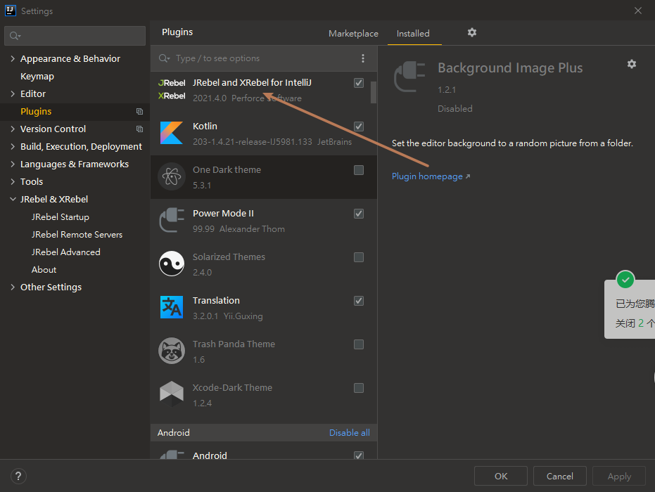
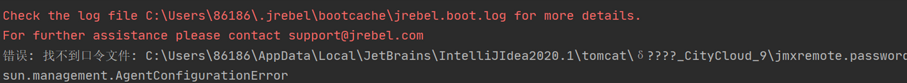

# Jrebel激活

## 一丶安装Jrebel插件



## 二丶激活Jrebel

### 1.下载本地代理工具

下载地址：https://github.com/ilanyu/ReverseProxy/releases/tag/v1.4


### 2.注册windows服务

因为代理工具需要一直启动着，Jrebel才能破解，Jrebel后续运行也需要代理工具一直运行，所以直接注册成windows服务

注册工具使用 Windows Service Wrapper

注册工具下载地址：https://github.com/Aaron-Ge/WinSWForSpringboot


将两个文件改成相同的名字，例如JrebelService


JrebelService.xml配置内容：

```xml
<service>
  
  <!-- ID of the service. It should be unique across the Windows system-->
  <id>JrebelService</id>
  <!-- Display name of the service -->
  <name>JrebelService</name>
  <!-- Service description -->
  <description>用于Jrebel激活</description>
  
  <!-- Path to the executable, which should be started 
  
  -->
  <executable>D:\code\code_run\Jrebel\Jrebel.exe</executable>
   <!-- 开机启动 -->
   <startmode>Automatic</startmode>
  
   <!--Xmx256m 代表堆内存最大值为256MB -jar后面的是项目名 <arguments>Jrebel.exe</arguments>-->
    
    <!--日志模式-->
	<logpath>logs/service</logpath>
    <logmode>rotate</logmode>

</service>
```

将下载的代理工具改名为Jrebel.exe然后放到和注册工具同级目录下


批处理命令:

```bash
JrebelService.exe install   #安装服务
JrebelService.exe start  #启动服务
JrebelService.exe restart  #重启服务
JrebelService.exe stop  #停止服务
JrebelService.exe uninstall #卸载服务
```

运行安装和启动服务的命令。

### 3.激活Jrebel


代理地址：http://127.0.0.1:8888/{GUID}

GUID生成：http://www.ofmonkey.com/transfer/guid

邮箱：自己的邮箱

## 三丶可能遇到的问题

### 1.系统用户名中文




解决办法：

修改IDEA配置,增加参数:  -Duser.home=D:\\data\\ideaconf


然后保存重启（这个修改会修改idea以及所有与之相关的所有文件都会移动到此 可以理解为把c:/user/XXXX）中会生成的文件都挪到这了

### 2.jrebel.jar不兼容问题


解决办法:

(1)下载新版本的jrebel.jar

​	下载地址:https://plugins.jetbrains.com/plugin/4441-jrebel-and-xrebel-for-intellij/versions


(2)解压到一个路径下（D:\data\ideaconf\.jrebel\jr-ide-idea\lib\jrebel6\jrebel.exe）


(3)设置IDEA中的Jrebel

<details open>
    <summary>图片展示</summary>
    
</details>

(4)重启IDEA


